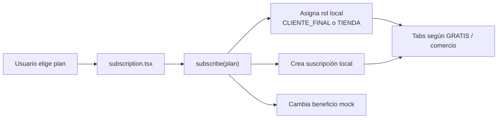

# Frontend · Selección de plan

No existe hoy un `POST` de suscripción. Tampoco se envía al backend si el registro corresponde a cliente final o personal de marca. Ésta es una diferencia deliberadamente visible con el contrato objetivo.

## Referencias de código

- [Pantalla y opciones de plan](https://github.com/gonzalotev/app-fidelidad/blob/afec4792729b48de4646168846ab221c96352f51/app/(auth)/subscription.tsx#L10-L114)
- [Suscripción local y cambio de rol](https://github.com/gonzalotev/app-fidelidad/blob/afec4792729b48de4646168846ab221c96352f51/src/features/auth/store/useAuthStore.ts#L66-L98)

## Contrato objetivo

En el spec `v1.5-review`, el tipo de cuenta se declara al registrar; un cliente final no contrata una suscripción. La marca se crea en un paso posterior y Backoffice administra su suscripción por sucursales. Los precios, períodos y cambios están en `PROPUESTA CODEX PC-03`, todavía pendiente de aprobación.
