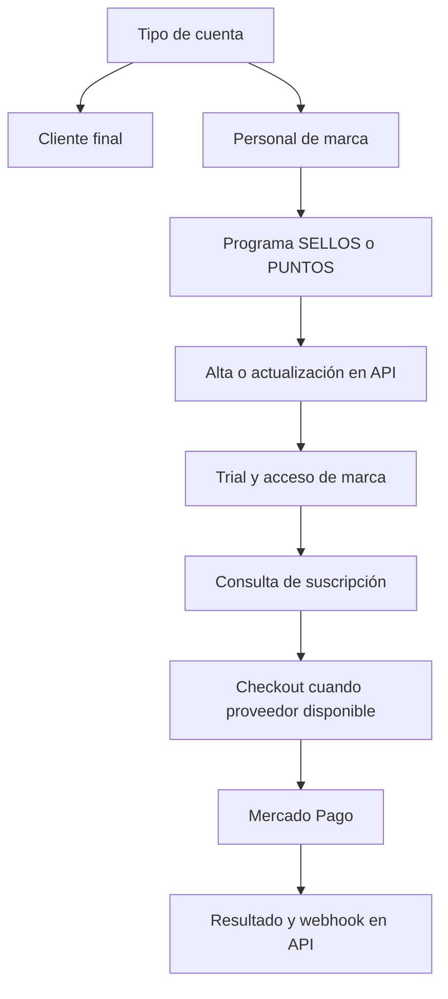

# Programa y suscripción comercial

```mermaid
flowchart TD
 A[Tipo de cuenta] --> C[Cliente final]
 A --> M[Personal de marca]
 M --> P[Programa SELLOS o PUNTOS]
 P --> API[Alta o actualización en API]
 API --> T[Trial y acceso de marca]
 T --> S[Consulta de suscripción]
 S --> CH[Checkout cuando proveedor disponible]
 CH --> MP[Mercado Pago]
 MP --> R[Resultado y webhook en API]
```

Las pantallas de selección ya no modifican un plan mock global. El alta comercial y la edición del programa se persisten; la suscripción consulta `/v1/marcas/:id/suscripcion`. Checkout/cancelación usan claves idempotentes y el resultado se obtiene del servidor. El cobro depende de la configuración de Mercado Pago: testing lo habilita y producción observada lo deshabilita. No se confirma una suscripción sólo por navegar de regreso a la app.

Cuenta, rol de membresía, programa y estado de cobro no son sinónimos. No se fijan precios comerciales en esta documentación.

Revisión de fuentes y runtime del **02/10/2026, 22:30–22:33 UTC**. Los SHA y las diferencias por ambiente están en [Estado observado](#/runtime-snapshot). Esta revisión describe arquitectura e integración; no certifica todos los invariantes de negocio ni ejecuta operaciones sobre cuentas reales.

## Referencias de código

- [Implementación frontend](https://github.com/gonzalotev/app-fidelidad/blob/main/src/features/merchant/services/subscriptionService.ts)
- [Rutas API](https://github.com/am-p/app-loyalty/blob/main/cmd/server/router.go)
