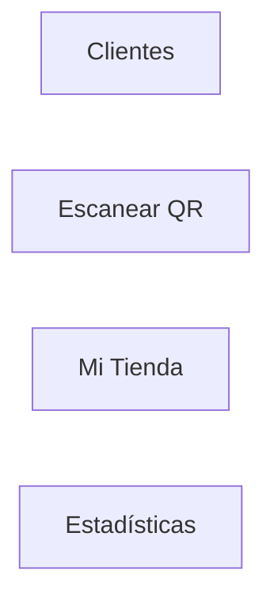

# Flujos · Personal del comercio

```mermaid
flowchart LR
    CUSTOMERS["Clientes"]
    SCANNER["Escanear QR"]
    PROFILE["Mi Tienda"]
    ANALYTICS["Estadísticas"]

    click CUSTOMERS href "#/flow-merchant-customers" "Abrir clientes"
    click SCANNER href "#/flow-merchant-scanner" "Abrir escaneo"
    click PROFILE href "#/flow-merchant-profile" "Abrir perfil"
    click ANALYTICS href "#/flow-merchant-analytics" "Abrir analíticas"
```
