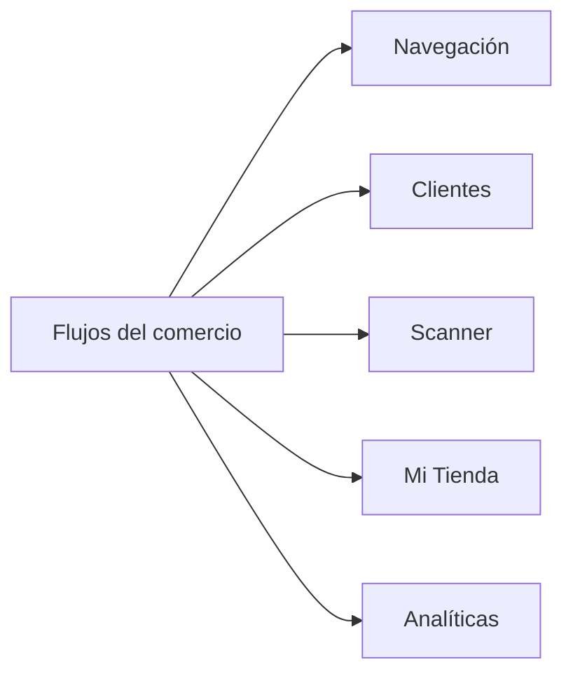

# Flujos del comercio

Revisión de fuentes y runtime del **02/10/2026, 22:30–22:33 UTC**. Los SHA y las diferencias por ambiente están en [Estado observado](#/runtime-snapshot). Esta revisión describe arquitectura e integración; no certifica todos los invariantes de negocio ni ejecuta operaciones sobre cuentas reales.

- [Navegación](#/flow-merchant-navigation)
- [Clientes](#/flow-merchant-customers)
- [Scanner](#/flow-merchant-scanner)
- [Mi Tienda](#/flow-merchant-profile)
- [Analíticas](#/flow-merchant-analytics)

## Referencias de código

- [Router y navegación](https://github.com/gonzalotev/app-fidelidad/blob/main/app/(tabs)/_layout.tsx)
