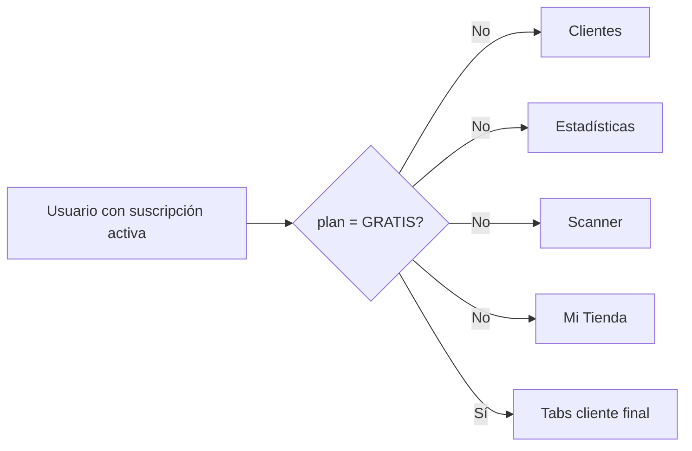

# Comercio · Navegación

El guard se basa en `suscripcion.plan`, no en el rol ni en una membresía a marca. Esto funciona para el prototipo, pero no representa varias marcas, sucursales o permisos internos.

En el contrato aprobado `PR-01`/`PR-05`, el guard objetivo se basa en cuenta activa,
membresía, rol, asignación de sucursal y acceso gratuito vigente. No crea una
suscripción ficticia. `PROPIETARIO` y `ADMINISTRADOR` administran según la matriz;
`OPERADOR` sólo acumula/canjea en sucursales asignadas.

Desde `afec4792`, la barra inferior usa siempre la paleta fija de Puntazo (`colors.primary` y `colors.surface`). El layout ya no consulta `usePerfilTienda()` para obtener `color_marca` o `color_secundario`; esos colores continúan disponibles para representar la tarjeta de fidelización, pero no personalizan el chrome de navegación.

El cambio es exclusivamente visual: no modifica las tabs habilitadas, la autenticación, los endpoints ni el contrato con el backend. El botón QR también adopta el helper compartido `getHardShadow()` para unificar la sombra entre web, iOS y Android.

## Referencias de código

- [Guard, paleta fija y visibilidad de tabs](https://github.com/gonzalotev/app-fidelidad/blob/afec4792729b48de4646168846ab221c96352f51/app/(tabs)/_layout.tsx#L13-L139)
- [Sombra compartida del botón QR](https://github.com/gonzalotev/app-fidelidad/blob/afec4792729b48de4646168846ab221c96352f51/app/(tabs)/LayoutStyle.ts#L37-L52)
