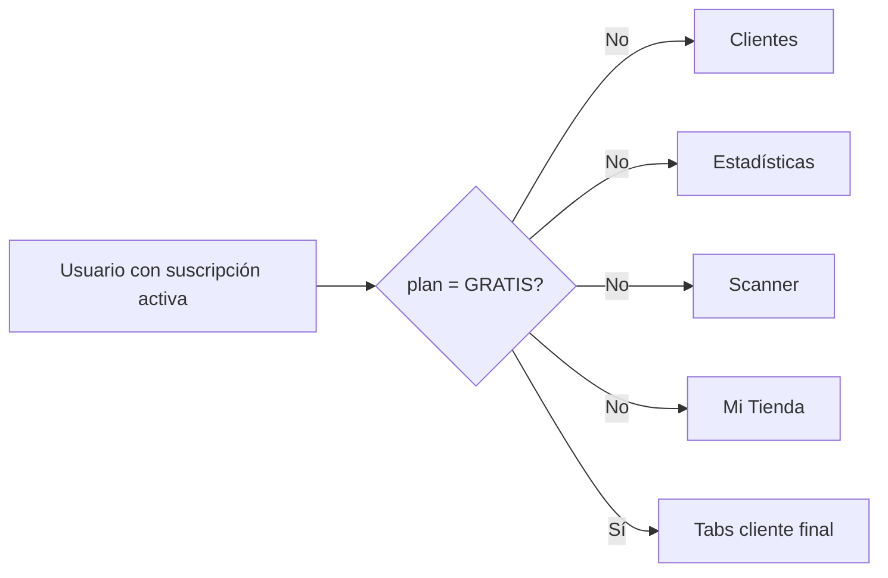

# Comercio · Navegación

El guard se basa en `suscripcion.plan`, no en el rol ni en una membresía a marca. Esto funciona para el prototipo, pero no representa varias marcas, sucursales o permisos internos.

## Referencias de código

- [Guard y visibilidad de tabs](https://github.com/gonzalotev/app-fidelidad/blob/99a350bd6e204a1f866d78dcfb20bd9bc108ffda/app/(tabs)/_layout.tsx#L17-L141)
