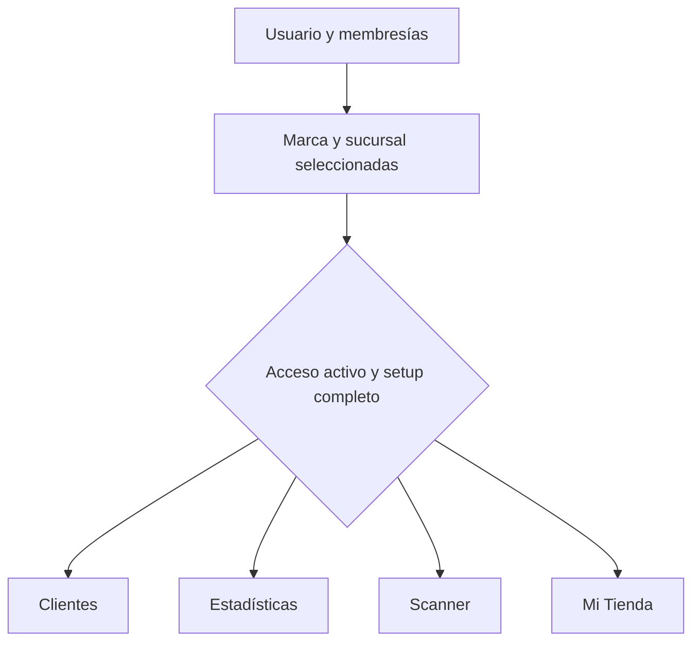

# Navegación comercial

```mermaid
flowchart TD
 ME[Usuario y membresías] --> CTX[Marca y sucursal seleccionadas]
 CTX --> A{Acceso activo y setup completo}
 A --> C[Clientes]
 A --> E[Estadísticas]
 A --> S[Scanner]
 A --> P[Mi Tienda]
```

El layout exige usuario activo y usa `PERSONAL_MARCA` para la navegación comercial. El setup y el acceso de marca pueden bloquear la entrada. La selección de marca/sucursal se recuerda localmente; la API sigue verificando el alcance de cada operación. Las restricciones por rol no se deducen de que una pestaña esté visible.

Revisión de fuentes y runtime del **02/10/2026, 22:10 UTC**. Los SHA y las diferencias por ambiente están en [Estado observado](#/runtime-snapshot). Esta revisión describe arquitectura e integración; no certifica todos los invariantes de negocio ni ejecuta operaciones sobre cuentas reales.

## Referencias de código

- [Implementación frontend](https://github.com/gonzalotev/app-fidelidad/blob/main/app/(tabs)/_layout.tsx)
- [Rutas API](https://github.com/am-p/app-loyalty/blob/main/cmd/server/router.go)
