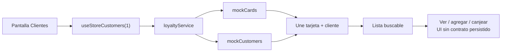

# Comercio · Clientes

La tienda está fijada a `id_tienda = 1`; los filtros y los cambios sólo afectan la experiencia local.

## Referencias de código

- [Pantalla de clientes](https://github.com/gonzalotev/app-fidelidad/blob/main/app/(tabs)/customers/index.tsx#L78-L155)
- [Join sobre mocks](https://github.com/gonzalotev/app-fidelidad/blob/main/src/features/loyalty/services/loyaltyService.ts#L87-L99)

## API objetivo

`GET /marcas/{id_marca}/clientes` deberá devolver tarjetas y saldos consolidados de la marca, con autorización por membresía.
