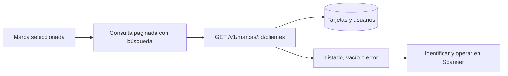

# Clientes del comercio

```mermaid
flowchart LR
 C[Marca seleccionada] --> Q[Consulta paginada con búsqueda]
 Q --> API[GET /v1/marcas/:id/clientes]
 API --> P[(Tarjetas y usuarios)]
 API --> L[Listado, vacío o error]
 L --> S[Identificar y operar en Scanner]
 click S href "#/flow-merchant-scanner" "Ver scanner"
```

`merchantService.customers` envía `page`, `page_size` y búsqueda acotada. El listado pertenece a la marca autorizada y proviene de PostgreSQL. Las acciones de acumulación/canje terminan en el flujo transaccional; editar el listado no cambia el saldo.

Revisión de fuentes y runtime del **02/10/2026, 22:10 UTC**. Los SHA y las diferencias por ambiente están en [Estado observado](#/runtime-snapshot). Esta revisión describe arquitectura e integración; no certifica todos los invariantes de negocio ni ejecuta operaciones sobre cuentas reales.

## Referencias de código

- [Implementación frontend](https://github.com/gonzalotev/app-fidelidad/blob/main/src/features/merchant/services/merchantService.ts)
- [Rutas API](https://github.com/am-p/app-loyalty/blob/main/cmd/server/router.go)
