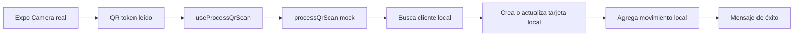

# Comercio · Escaneo QR

El servicio usa sucursal `101` y tienda `1`. Sellos suma uno y reinicia a uno al superar el máximo; Puntos suma diez sin considerar importe. Estas reglas no deben trasladarse al backend objetivo.

## Referencias de código

- [Pantalla y captura](https://github.com/gonzalotev/app-fidelidad/blob/main/app/(tabs)/scanner/index.tsx#L10-L91)
- [Mutación de escaneo](https://github.com/gonzalotev/app-fidelidad/blob/main/src/features/loyalty/hooks/useLoyalty.ts#L16-L30)
- [Reglas mock](https://github.com/gonzalotev/app-fidelidad/blob/main/src/features/loyalty/services/loyaltyService.ts#L101-L147)
