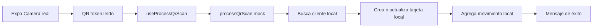

# Comercio · Escaneo QR

## Actualización de códigos · rama pendiente de integrar

Identificación manual: teclado alfanumérico, GG-1 y código anterior, # opcional.
Normaliza para customer_code y usa coincidencia exacta para búsqueda comercial.
El preview y el resultado muestran user_code emitido por la API.

Fuente y estado: [reconciliación de códigos](#/user-codes-reconciliation).
Implementado y probado en las ramas seleccionadas; no desplegado.

## Referencia histórica anterior a esta entrega

El material siguiente describe la revisión documental anterior. No confirma
el estado actual de main ni del runtime; contrastar con la rama elegida.

```mermaid
flowchart LR
    CAMERA["Expo Camera real"] --> TOKEN["QR token leído"]
    TOKEN --> HOOK["useProcessQrScan"]
    HOOK --> MOCK["processQrScan mock"]
    MOCK --> FIND["Busca cliente local"]
    FIND --> CARD["Crea o actualiza tarjeta local"]
    CARD --> MOVE["Agrega movimiento local"]
    MOVE --> RESULT["Mensaje de éxito"]

    click MOCK href "#/sequence-scan" "Ver secuencia exacta"
    click CARD href "#/data-current" "Ver estructuras mock"
```

El servicio usa sucursal `101` y tienda `1`. Sellos suma uno y reinicia a uno al superar el máximo; Puntos suma diez sin considerar importe. Estas reglas no deben trasladarse al backend objetivo.

## Referencias de código

- [Pantalla y captura](https://github.com/gonzalotev/app-fidelidad/blob/main/app/(tabs)/scanner/index.tsx#L10-L91)
- [Mutación de escaneo](https://github.com/gonzalotev/app-fidelidad/blob/main/src/features/loyalty/hooks/useLoyalty.ts#L16-L30)
- [Reglas mock](https://github.com/gonzalotev/app-fidelidad/blob/main/src/features/loyalty/services/loyaltyService.ts#L101-L147)
