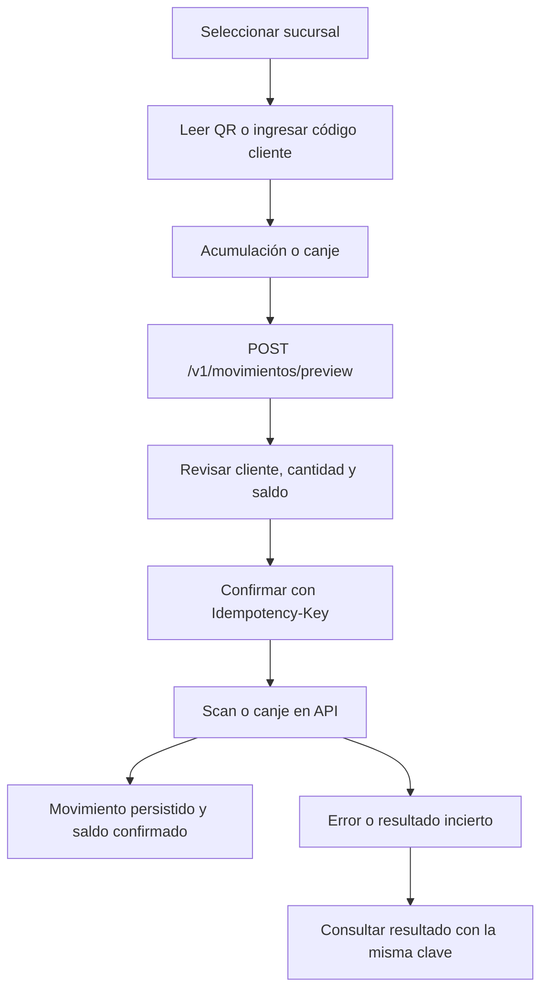

# Scanner y operación

```mermaid
flowchart TD
 A[Seleccionar sucursal] --> I[Leer QR o ingresar código cliente]
 I --> O[Acumulación o canje]
 O --> P[POST /v1/movimientos/preview]
 P --> V[Revisar cliente, cantidad y saldo]
 V --> C[Confirmar con Idempotency-Key]
 C --> API[Scan o canje en API]
 API --> R[Movimiento persistido y saldo confirmado]
 API --> E[Error o resultado incierto]
 E --> K[Consultar resultado con la misma clave]
```

La cámara es una entrada de identidad; el código manual es otra. La API resuelve identidad, autorización, preview y escritura. El programa determina sellos/puntos; el canje identifica beneficio. La confirmación no usa un array local. Ante fallo de red después del commit, se consulta idempotencia para evitar duplicar una operación. Sin conexión se bloquea la operación; no existe cola offline de confirmaciones.

Ver [secuencia de scan](#/sequence-scan).

Revisión de fuentes y runtime del **02/10/2026, 22:10 UTC**. Los SHA y las diferencias por ambiente están en [Estado observado](#/runtime-snapshot). Esta revisión describe arquitectura e integración; no certifica todos los invariantes de negocio ni ejecuta operaciones sobre cuentas reales.

## Referencias de código

- [Implementación frontend](https://github.com/gonzalotev/app-fidelidad/blob/main/src/features/demo/services/demoService.ts)
- [Rutas API](https://github.com/am-p/app-loyalty/blob/main/cmd/server/router.go)
