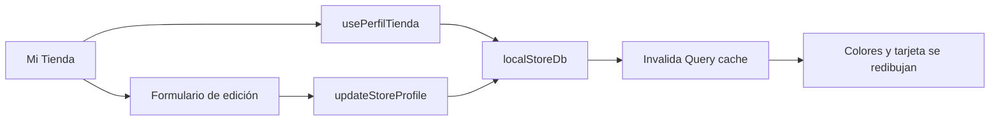

# Comercio · Perfil de marca

El flujo representa una tienda única. El modelo objetivo reemplaza este contexto implícito por una marca explícita y sus sucursales.

## Contrato aprobado

`PR-03` habilita edición persistida de marca, sucursales, programa, beneficios y
membresías. Cada mutación sobre un recurso existente exige `If-Match`; una versión
obsoleta responde `412`. Las bajas son lógicas y los movimientos conservan
snapshots históricos. `PR-04` agrega media privada S3-compatible validada por el
backend, con límite de 5 MiB por archivo.

## Referencias de código

- [Pantalla de perfil comercial](https://github.com/gonzalotev/app-fidelidad/blob/1db7717e1aa28c2c1be7ba3538bfe9e22e0d0a01/app/(tabs)/profile/index.tsx#L32-L119)
- [Servicio de perfil local](https://github.com/gonzalotev/app-fidelidad/blob/1db7717e1aa28c2c1be7ba3538bfe9e22e0d0a01/src/features/profile/services/profileService.ts#L23-L88)
