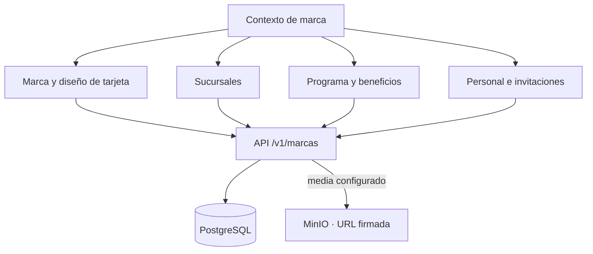

# Mi Tienda y edición comercial

```mermaid
flowchart TD
 C[Contexto de marca] --> B[Marca y diseño de tarjeta]
 C --> S[Sucursales]
 C --> P[Programa y beneficios]
 C --> E[Personal e invitaciones]
 B --> API[API /v1/marcas]
 S --> API
 P --> API
 E --> API
 API --> PG[(PostgreSQL)]
 API -->|media configurado| M[MinIO · URL firmada]
```

`commercialService` usa lecturas y escrituras reales para marca, sucursal, programa y beneficios. Las mutaciones versionadas envían la precondición correspondiente; un conflicto requiere releer. `personnelService` gestiona personal/invitaciones y `mediaService` las imágenes. No se atribuyen permisos de propietario al operador.

La plantilla forma parte del diseño de marca y sus valores se restringen en migraciones. Media funciona en testing; la API productiva observada tiene el proveedor deshabilitado. La mejora de guardado/imagen de beneficio está en testing y difiere de main.

Revisión de fuentes y runtime del **02/10/2026, 22:30–22:33 UTC**. Los SHA y las diferencias por ambiente están en [Estado observado](#/runtime-snapshot). Esta revisión describe arquitectura e integración; no certifica todos los invariantes de negocio ni ejecuta operaciones sobre cuentas reales.

## Referencias de código

- [Implementación frontend](https://github.com/gonzalotev/app-fidelidad/blob/main/src/features/merchant/services/commercialService.ts)
- [Rutas API](https://github.com/am-p/app-loyalty/blob/main/cmd/server/router.go)
