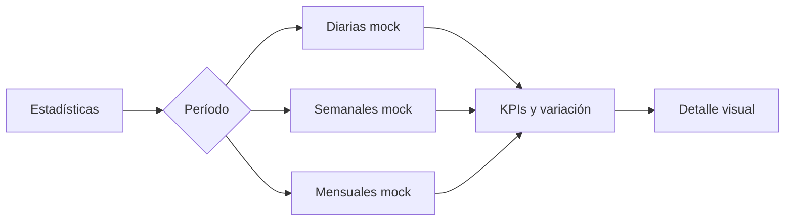

# Comercio · Analíticas

No hay consultas al backend, persistencia ni filtros reales por marca o sucursal.

## Referencias de código

- [Pantalla de analíticas](https://github.com/gonzalotev/app-fidelidad/blob/main/app/(tabs)/analytics/index.tsx#L33-L90)
- [Servicio de métricas mock](https://github.com/gonzalotev/app-fidelidad/blob/main/src/features/analytics/services/analyticsService.ts#L1-L140)

## API objetivo

La propuesta incluye métricas de marca diarias, semanales, mensuales y drill-down, con filtro opcional por sucursal.
