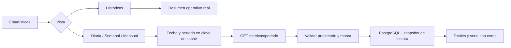

# Comercio · Analíticas

## Implementación por períodos · integración testing 02/10/2026

El pedido del usuario selecciona recuperar las vistas diaria, semanal y mensual con datos reales. El alcance de esta entrega es actividad operativa confirmada, consolidada para todas las sucursales de la marca. No aprueba el contrato analítico amplio `PC-08` ni sus métricas de retención, importes o recordatorios.

La nueva ruta `GET /v1/marcas/{brand_id}/metricas/periodo` acepta `period=day|week|month` y `date=YYYY-MM-DD` opcional. Sin fecha utiliza hoy en la zona horaria de la marca. Día y mes son calendarios; la semana empieza el lunes. El inicio es inclusivo y el final exclusivo. Fechas futuras e inputs inválidos se rechazan; cambiar de período nunca reutiliza los valores del anterior como si fueran actuales.

Las vistas permiten navegar hacia períodos anteriores y volver al actual. Muestran clientes atendidos distintos, acumulaciones, canjes, operaciones totales, una serie de actividad. Las cantidades emitidas/canjeadas permanecen disponibles en la respuesta API; las tarjetas simplificadas muestran sólo el valor primario. Diaria agrupa por hora local; semanal y mensual por fecha local. Se incluyen intervalos sin actividad con cero. En cambios de horario de verano, una hora repetida se consolida y una hora inexistente queda en cero.

La autorización coincide con el resumen histórico: personal de marca con membresía activa `PROPIETARIO`, usuario y marca vigentes. No se amplía acceso a administradores u operadores. No se filtra por la sucursal operativa seleccionada; los datos abarcan todas las sucursales. El ledger histórico sigue contado aunque se desactive o anonimice un cliente.

```mermaid
flowchart LR
    SCREEN[Estadísticas] --> RANGE{Vista}
    RANGE --> HIST[Históricas]
    RANGE --> PERIOD[Diaria / Semanal / Mensual]
    HIST --> SUMMARY[Resumen operativo real]
    PERIOD --> QUERY[Fecha y período en clave de caché]
    QUERY --> API[GET metricas/periodo]
    API --> AUTH[Validar propietario y marca]
    AUTH --> LEDGER[PostgreSQL · snapshot de lectura]
    LEDGER --> KPIS[Totales y serie con ceros]
```

## Estado anterior y despliegue

El commit histórico `a33036b` creó las tres hojas con constantes mock y se integró en la PR #1. En agosto se reemplazó por el resumen operativo conectado a datos reales. Las ramas fuente verificadas al empezar esta entrega fueron frontend `origin/testing` en `845658b` y backend oficial `origin/main` en `df04f62`.

La captura anterior de testing muestra totales históricos y “Hasta hoy”; no demuestra la nueva ruta ni las nuevas vistas. El frontend se integró mediante la [PR #38](https://github.com/gonzalotev/app-fidelidad/pull/38) en `gonzalotev/app-fidelidad:testing`, HEAD `b712c5d5e10154021955ae677935372eafdbdff5`. El backend se promovió mediante la [PR #9 del fork](https://github.com/gagonzalez1/app-loyalty/pull/9) a `gagonzalez1/app-loyalty:testing`, HEAD `f18ff083666e70954bfe8474a228dcca365f40bb`. Estos SHAs registran la integración observada; no seleccionan futuros builds. La API de testing se verificó en `https://api-testing.puntazo.pro/v1/version`: commit `f18ff083666e70954bfe8474a228dcca365f40bb`, esquema `0033`; readiness respondió HTTP 200. El despliegue Coolify `o9busnp3snb29gtnsilozook` finalizó. La web se desplegó mediante `tdjvihwta92rholokxhsojmt`, finalizado a las 03:35:32 UTC del 02/10/2026. El contenedor saludable sirve `b712c5d5e10154021955ae677935372eafdbdff5`. La ruta pública `/analytics` respondió HTTP 200; su bundle `entry-02cfe92eb90cf2efc068d0e7613e66cb.js` coincide con el del contenedor (SHA-256 `05ce4299b27a747084b13499404c373025fcc2e8fa0730dd671bf37062621a28`). El manifest respondió HTTP 200 y declara `standalone`; el service worker respondió HTTP 200 con `no-store`. Tras repetir el gate de fuentes remotas vigentes y checkouts limpios antes de los builds, se verificó el runtime público y no se reutilizaron SHAs históricos como selectores. La [PR oficial #26](https://github.com/am-p/app-loyalty/pull/26) sigue abierta: no se atribuye esta implementación a `am-p/app-loyalty:main`. Producción no se modifica.

La entrega queda en [PR frontend #38](https://github.com/gonzalotev/app-fidelidad/pull/38), commit `05418d0`, y [PR backend oficial #26](https://github.com/am-p/app-loyalty/pull/26), commit `e62c2f5`. Se comprobó TypeScript, 113 tests unitarios, Expo Doctor 18/18, build web/PWA y cuatro pruebas de navegador. La lectura PostgreSQL tiene pruebas de permisos, marcas, sucursales, límites y DST. Además se verificó el frontend exportado con API Go y PostgreSQL 16 locales, datos sintéticos persistidos y recarga de sesión; no se probó un dispositivo nativo. Estas validaciones locales preceden al despliegue solicitado y no prueban el runtime público. La suite completa del backend con PostgreSQL y detector de carreras pasó. Se corrigió únicamente la fecha del fixture previo `TestPostgresAuthenticatedDemoRegistrationStartsTrial`, que había vencido y fallaba también en la base limpia; se conservaron sus assertions y el comportamiento de suscripciones.

La CI de frontend aprueba TypeScript/tests/doctor/build pero falla la auditoría de dependencias por `GHSA-86w9-cpqp-85rv` en `node-forge`, heredado de la base. El advisory revisado al 01/10/2026 afecta hasta 1.4.0 y no lista una versión corregida. Después de la divulgación del advisory, el usuario autorizó una vez continuar con la integración y el despliegue exclusivo a testing. La autorización no resuelve la vulnerabilidad ni aprueba producción. La auditoría continúa fallida y sin modificar: no se agregó allowlist, override ni excepción al chequeo, y se conserva Expo SDK 54. [Advisory](https://github.com/advisories/GHSA-86w9-cpqp-85rv).

En el navegador integrado se verificaron las cuatro vistas Diaria, Semanal, Mensual e Históricas con respuestas reales vacías de un comercio sintético existente, navegación al mes anterior y restauración de sesión después de recarga, sin errores JavaScript en consola. No se crearon movimientos de fidelidad para esta comprobación. La sesión sintética se cerró al terminar; la sesión previa del usuario había vuelto al login al recargar. La validación pública confirma carga y estados vacíos; los conteos no vacíos se verificaron previamente con datos persistidos sintéticos en la integración local. No se probó un dispositivo físico.

## Ajuste visual solicitado · 02/10/2026

La [PR frontend #41](https://github.com/gonzalotev/app-fidelidad/pull/41), integrada en `testing` en `615af6fed1b676c1ad24179793b30de01748bb5f`, elimina la línea de sucursales/zona horaria y el botón “Actualizar estadísticas”; también elimina la línea duplicada de alcance de Históricas. Se conserva el cálculo por zona horaria de la marca, las consultas automáticas, la navegación de períodos, pull-to-refresh y los reintentos de error. TypeScript, 113 tests, Doctor18/18, build web/PWA y cuatro pruebas de navegador pasaron. Despliegue web `8y576ligqsireuvsmgxkjfi6` finalizado a las 13:28:03 UTC, contenedor saludable y bundle público `entry-39b961d147e6ecad4f69ce61873bf906.js` coincidente con el del contenedor (SHA-256 `02703d34c59faec12df7eb7daef60874147f81985f0fc5accc380e24412d073c`). Se comprobó en el navegador integrado la ausencia de ambos elementos y la línea duplicada histórica; no hubo errores JavaScript. La sesión previa volvió al login al activar la PWA; se verificó con una cuenta ficticia existente y se cerró al terminar. API y contratos sin cambios.

## KPI simplificados · aprobación visual local 02/10/2026

El usuario revisó primero la propuesta local y luego autorizó publicarla en testing. La [PR frontend #42](https://github.com/gonzalotev/app-fidelidad/pull/42), integrada en `testing` en `af1ca5e0e7d399cde2db33cde0700db477aa04e8`, agrega una variante centrada de KpiCard utilizada sólo por Analíticas. Íconos, títulos y valores se alinean al centro; tarjetas y títulos reservan alturas uniformes, incluso en la vista compacta. Se eliminan los subtítulos de las cuatro vistas. Acumulaciones y canjes siguen mostrando cantidad de operaciones, sin confundirse con cantidad de sellos/puntos. En Históricas las cantidades emitidas/canjeadas permanecen en los detalles/gráficos y ayuda. TypeScript,113tests,Doctor18/18,build/PWA y4browser checks pasan. Deployment `dnmtcvj8dgt8x7smsvduybhl` finalizado a las 15:42:20 UTC, contenedor saludable. Bundle público `entry-46ea23a3ff5006727005252554ad3350.js` coincidente con el del contenedor (SHA-256 `0cc010bc2a0540464a3765f325245bc6f96ecf71b05a794bafb751ad85d2baee`). Cuatro vistas verificadas con respuestas reales vacías de la cuenta ficticia existente, sin errores JS. La PWA activó el nuevo bundle; la sesión pidió login y se restauró ingresando a la cuenta ficticia. API f18ff083 y esquema0033 no cambian. La CI37028331065 pasa typecheck/tests/doctor/build y conserva el fallo del advisory heredado informado; no se modificó la auditoría ni se agregó allowlist.

## Datos y límites

- “Clientes atendidos” cuenta clientes distintos con movimientos en el período. “Clientes activos” y “Saldo vigente” son estados actuales, disponibles en Históricas; no se presentan como estados del pasado.
- Sólo se agregan movimientos confirmados, con las mismas definiciones de acumulación, canje y cantidades del resumen histórico.
- Retención, fuga, frecuencia, recordatorios, comparación y drill-down del diseño antiguo no se recuperan con números simulados.
- La actividad reciente de Históricas conserva su alcance propio; no pretende corresponder al período seleccionado.
- No se requiere migración: se utiliza el ledger y el índice por marca/fecha existentes.

## Referencias de código

- [Fuente frontend de la entrega](https://github.com/gonzalotev/app-fidelidad/blob/feat/analytics-periods-20261001/app/(tabs)/analytics/index.tsx).
- [Fuente backend de la entrega y OpenAPI implementada](https://github.com/gagonzalez1/app-loyalty/blob/feat/analytics-periods-20261001/internal/repository/analytics.go).
- [Propuesta analítica amplia pendiente PC-08](#/backend-full-spec).
