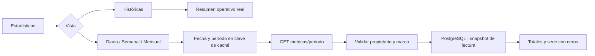

# Comercio · Analíticas

## Implementación por períodos · rama de trabajo 01/10/2026

El pedido del usuario selecciona recuperar las vistas diaria, semanal y mensual con datos reales. El alcance de esta entrega es actividad operativa confirmada, consolidada para todas las sucursales de la marca. No aprueba el contrato analítico amplio `PC-08` ni sus métricas de retención, importes o recordatorios.

La nueva ruta `GET /v1/marcas/{brand_id}/metricas/periodo` acepta `period=day|week|month` y `date=YYYY-MM-DD` opcional. Sin fecha utiliza hoy en la zona horaria de la marca. Día y mes son calendarios; la semana empieza el lunes. El inicio es inclusivo y el final exclusivo. Fechas futuras e inputs inválidos se rechazan; cambiar de período nunca reutiliza los valores del anterior como si fueran actuales.

Las vistas permiten navegar hacia períodos anteriores y volver al actual. Muestran clientes atendidos distintos, acumulaciones, canjes, operaciones totales, cantidades emitidas/canjeadas y una serie de actividad. Diaria agrupa por hora local; semanal y mensual por fecha local. Se incluyen intervalos sin actividad con cero. En cambios de horario de verano, una hora repetida se consolida y una hora inexistente queda en cero.

La autorización coincide con el resumen histórico: personal de marca con membresía activa `PROPIETARIO`, usuario y marca vigentes. No se amplía acceso a administradores u operadores. No se filtra por la sucursal operativa seleccionada; la UI informa el alcance de todas las sucursales. El ledger histórico sigue contado aunque se desactive o anonimice un cliente.

```mermaid
flowchart LR
    SCREEN[Estadísticas] --> RANGE{Vista}
    RANGE --> HIST[Históricas]
    RANGE --> PERIOD[Diaria / Semanal / Mensual]
    HIST --> SUMMARY[Resumen operativo real]
    PERIOD --> QUERY[Fecha y período en clave de caché]
    QUERY --> API[GET metricas/periodo]
    API --> AUTH[Validar propietario y marca]
    AUTH --> LEDGER[PostgreSQL · snapshot de lectura]
    LEDGER --> KPIS[Totales y serie con ceros]
```

## Estado anterior y despliegue

El commit histórico `a33036b` creó las tres hojas con constantes mock y se integró en la PR #1. En agosto se reemplazó por el resumen operativo conectado a datos reales. Las ramas fuente verificadas al empezar esta entrega fueron frontend `origin/testing` en `845658b` y backend oficial `origin/main` en `df04f62`.

La captura de testing muestra totales históricos y “Hasta hoy”; no demuestra que esta nueva ruta o las nuevas vistas estén desplegadas. La entrega se prepara en `feat/analytics-periods-20261001` de ambos repositorios dueños. La promoción a testing y el commit del frontend servido requieren verificación separada.

La entrega queda en [PR frontend #38](https://github.com/gonzalotev/app-fidelidad/pull/38), commit `05418d0`, y [PR backend oficial #26](https://github.com/am-p/app-loyalty/pull/26), commit `d24ce9b`. Se comprobó TypeScript, 113 tests unitarios, Expo Doctor 18/18, build web/PWA y cuatro pruebas de navegador. La lectura PostgreSQL tiene pruebas de permisos, marcas, sucursales, límites y DST. Además se verificó el frontend exportado con API Go y PostgreSQL 16 locales, datos sintéticos persistidos y recarga de sesión; no se probó un dispositivo nativo ni se desplegó. La suite completa del backend con DB tiene un fallo previo reproducido en la base limpia: `TestPostgresAuthenticatedDemoRegistrationStartsTrial` crea una sesión de fixture ya vencida; la suite sin DB y la suite DB excluyendo ese test pasaron.

## Datos y límites

- “Clientes atendidos” cuenta clientes distintos con movimientos en el período. “Clientes activos” y “Saldo vigente” son estados actuales, disponibles en Históricas; no se presentan como estados del pasado.
- Sólo se agregan movimientos confirmados, con las mismas definiciones de acumulación, canje y cantidades del resumen histórico.
- Retención, fuga, frecuencia, recordatorios, comparación y drill-down del diseño antiguo no se recuperan con números simulados.
- La actividad reciente de Históricas conserva su alcance propio; no pretende corresponder al período seleccionado.
- No se requiere migración: se utiliza el ledger y el índice por marca/fecha existentes.

## Referencias de código

- [Fuente frontend de la entrega](https://github.com/gonzalotev/app-fidelidad/blob/feat/analytics-periods-20261001/app/(tabs)/analytics/index.tsx).
- [Fuente backend de la entrega y OpenAPI implementada](https://github.com/gagonzalez1/app-loyalty/blob/feat/analytics-periods-20261001/internal/repository/analytics.go).
- [Propuesta analítica amplia pendiente PC-08](#/backend-full-spec).
