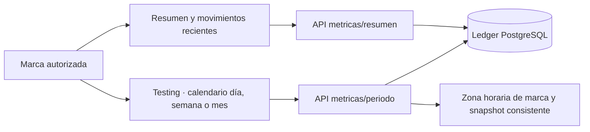

# Estadísticas comerciales

```mermaid
flowchart LR
 C[Marca autorizada] --> S[Resumen y movimientos recientes]
 C --> T[Testing · calendario día, semana o mes]
 S --> A[API metricas/resumen]
 T --> P[API metricas/periodo]
 A --> L[(Ledger PostgreSQL)]
 P --> L
 P --> Z[Zona horaria de marca y snapshot consistente]
```

Main publicado muestra resumen operativo y movimientos recientes. Testing publicado añade consulta por `period=day|week|month` y fecha. El backend de períodos ya está en main y testing. Agrega acumulaciones/canjes, clientes atendidos, sellos y puntos a partir del historial; no usa constantes locales. La autorización de períodos exige propietario y la lectura usa un snapshot `REPEATABLE READ`.

La rama testing incorpora además mejoras PWA aún ausentes en su imagen observada. Consultar [versiones](#/runtime-snapshot) antes de afirmar publicación.

Revisión de fuentes y runtime del **02/10/2026, 22:10 UTC**. Los SHA y las diferencias por ambiente están en [Estado observado](#/runtime-snapshot). Esta revisión describe arquitectura e integración; no certifica todos los invariantes de negocio ni ejecuta operaciones sobre cuentas reales.

## Referencias de código

- [Implementación frontend](https://github.com/gonzalotev/app-fidelidad/blob/main/app/(tabs)/analytics/index.tsx)
- [Rutas API](https://github.com/am-p/app-loyalty/blob/main/cmd/server/router.go)

- [Interfaz por períodos](https://github.com/gonzalotev/app-fidelidad/blob/testing/app/(tabs)/analytics/index.tsx)
- [Agregación](https://github.com/am-p/app-loyalty/blob/main/internal/repository/analytics.go)
