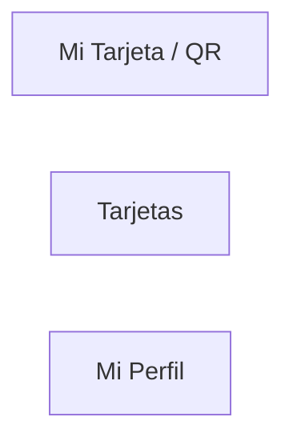

# Flujos · Cliente final

```mermaid
flowchart LR
    QR["Mi Tarjeta / QR"]
    CARDS["Tarjetas"]
    PROFILE["Mi Perfil"]

    click QR href "#/flow-customer-passport" "Abrir QR"
    click CARDS href "#/flow-customer-cards" "Abrir tarjetas"
    click PROFILE href "#/flow-customer-profile" "Abrir perfil"
```
