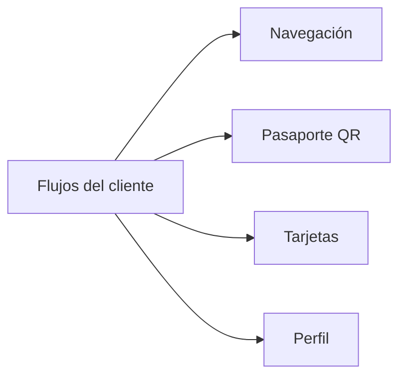

# Flujos del cliente

Revisión de fuentes y runtime del **02/10/2026, 22:10 UTC**. Los SHA y las diferencias por ambiente están en [Estado observado](#/runtime-snapshot). Esta revisión describe arquitectura e integración; no certifica todos los invariantes de negocio ni ejecuta operaciones sobre cuentas reales.

- [Navegación](#/flow-customer-navigation)
- [Pasaporte QR](#/flow-customer-passport)
- [Tarjetas](#/flow-customer-cards)
- [Perfil](#/flow-customer-profile)

## Referencias de código

- [Router y navegación](https://github.com/gonzalotev/app-fidelidad/blob/main/app/(tabs)/_layout.tsx)
