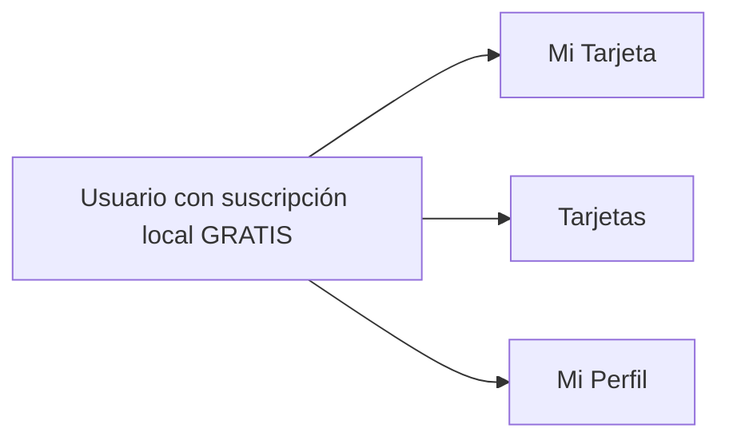

# Cliente · Navegación

La navegación funciona, aunque el guard depende de una suscripción `GRATIS` creada localmente. En el modelo objetivo el cliente final es gratuito y no tiene suscripción.

La barra inferior comparte la paleta fija de Puntazo con el recorrido comercial. El cambio `afec4792` no altera las tres tabs del cliente ni su lógica de selección; sólo unifica la presentación visual.

## Referencias de código

- [Tabs, paleta y criterio de plan](https://github.com/gonzalotev/app-fidelidad/blob/1db7717e1aa28c2c1be7ba3538bfe9e22e0d0a01/app/(tabs)/_layout.tsx#L13-L139)
