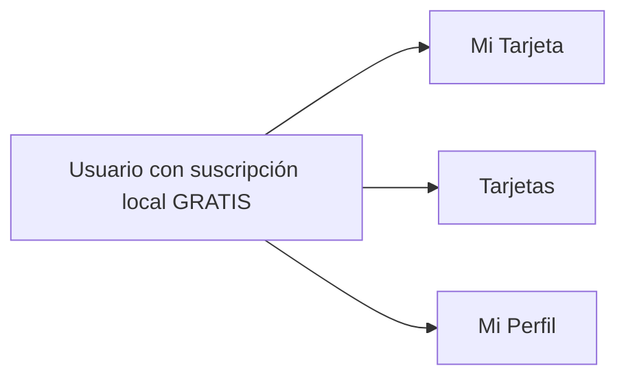

# Cliente · Navegación

La navegación funciona, aunque el guard depende de una suscripción `GRATIS` creada localmente. En el modelo objetivo el cliente final es gratuito y no tiene suscripción.

## Referencias de código

- [Tabs y criterio de plan](https://github.com/gonzalotev/app-fidelidad/blob/99a350bd6e204a1f866d78dcfb20bd9bc108ffda/app/(tabs)/_layout.tsx#L17-L141)
