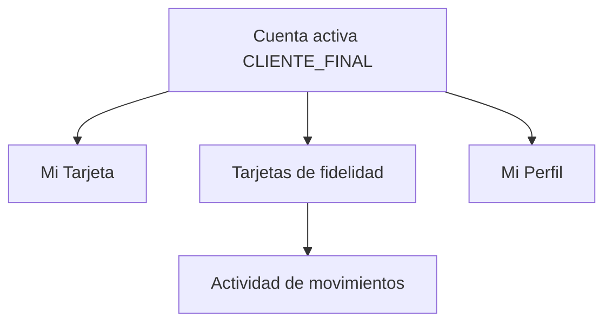

# Navegación del cliente

```mermaid
flowchart TD
 ME[Cuenta activa CLIENTE_FINAL] --> QR[Mi Tarjeta]
 ME --> C[Tarjetas de fidelidad]
 ME --> P[Mi Perfil]
 C --> H[Actividad de movimientos]
```

El layout usa `account_type` y sesión activa. El perfil comercial no se habilita con un cambio local de plan. Las lecturas cliente se hacen con la sesión autenticada y el servidor restringe usuario y tarjeta.

Revisión de fuentes y runtime del **02/10/2026, 22:30–22:33 UTC**. Los SHA y las diferencias por ambiente están en [Estado observado](#/runtime-snapshot). Esta revisión describe arquitectura e integración; no certifica todos los invariantes de negocio ni ejecuta operaciones sobre cuentas reales.

## Referencias de código

- [Implementación frontend](https://github.com/gonzalotev/app-fidelidad/blob/main/app/(tabs)/_layout.tsx)
- [Rutas API](https://github.com/am-p/app-loyalty/blob/main/cmd/server/router.go)
