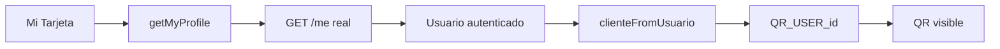

# Cliente · Pasaporte QR

El QR no es todavía un token opaco emitido por backend. Por ser derivable desde el ID del usuario, sólo sirve para el prototipo y no debe utilizarse como credencial de autorización.

## Referencias de código

- [Pantalla Mi Tarjeta](https://github.com/gonzalotev/app-fidelidad/blob/afec4792729b48de4646168846ab221c96352f51/app/(tabs)/my-card/index.tsx#L10-L50)
- [Derivación del perfil y QR](https://github.com/gonzalotev/app-fidelidad/blob/afec4792729b48de4646168846ab221c96352f51/src/features/auth/services/authService.ts#L46-L62)
- [Lectura real de usuario](https://github.com/gonzalotev/app-fidelidad/blob/afec4792729b48de4646168846ab221c96352f51/src/features/auth/services/authService.ts#L107-L121)
