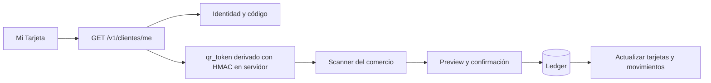

# Pasaporte QR del cliente

```mermaid
flowchart LR
 P[Mi Tarjeta] --> API[GET /v1/clientes/me]
 API --> U[Identidad y código]
 API --> QR[qr_token derivado con HMAC en servidor]
 QR --> S[Scanner del comercio]
 S --> M[Preview y confirmación]
 M --> H[(Ledger)]
 H --> R[Actualizar tarjetas y movimientos]
```

La pantalla renderiza el `qr_token` recibido. El QR no es el ID visible ni se reconstruye con un patrón frontend. PostgreSQL conserva el hash y la API valida la identidad para operar. El código humano es una alternativa manual: los nuevos códigos son inmutables y los anteriores conservan el formato heredado. Mostrar un QR no autentica al operador.

La detección de movimientos prepara una lectura base, compara saldos y valida movimientos antes de celebrar; web dispone además de eventos SSE autenticados para refrescar tarjetas.

Revisión de fuentes y runtime del **02/10/2026, 22:10 UTC**. Los SHA y las diferencias por ambiente están en [Estado observado](#/runtime-snapshot). Esta revisión describe arquitectura e integración; no certifica todos los invariantes de negocio ni ejecuta operaciones sobre cuentas reales.

## Referencias de código

- [Implementación frontend](https://github.com/gonzalotev/app-fidelidad/blob/main/app/(tabs)/my-card/index.tsx)
- [Rutas API](https://github.com/am-p/app-loyalty/blob/main/cmd/server/router.go)
