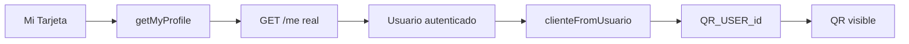

# Cliente · Pasaporte QR

## Actualización de códigos · rama pendiente de integrar

Mi Pasaporte consume user_code y qr_token de la API; muestra GG-1 en altas
nuevas o #USER-0001 en cuentas previas. No construye el nuevo código desde el ID
numérico ni usa el código público como credencial de autorización.

Fuente y estado: [reconciliación de códigos](#/user-codes-reconciliation).
Implementado y probado en las ramas seleccionadas; no desplegado.

## Referencia histórica anterior a esta entrega

El material siguiente describe la revisión documental anterior. No confirma
el estado actual de main ni del runtime; contrastar con la rama elegida.

```mermaid
flowchart LR
    SCREEN["Mi Tarjeta"] --> QUERY["getMyProfile"]
    QUERY --> ME["GET /me real"]
    ME --> USER["Usuario autenticado"]
    USER --> MAP["clienteFromUsuario"]
    MAP --> TOKEN["QR_USER_id"]
    TOKEN --> QR["QR visible"]

    click ME href "#/sequence-restore" "Ver sesión y GET /me"
    click TOKEN href "#/implementation-gaps" "Ver brecha de QR"
```

El QR no es todavía un token opaco emitido por backend. Por ser derivable desde el ID del usuario, sólo sirve para el prototipo y no debe utilizarse como credencial de autorización.

## Referencias de código

- [Pantalla Mi Tarjeta](https://github.com/gonzalotev/app-fidelidad/blob/main/app/(tabs)/my-card/index.tsx#L10-L50)
- [Derivación del perfil y QR](https://github.com/gonzalotev/app-fidelidad/blob/main/src/features/auth/services/authService.ts#L46-L62)
- [Lectura real de usuario](https://github.com/gonzalotev/app-fidelidad/blob/main/src/features/auth/services/authService.ts#L107-L121)
