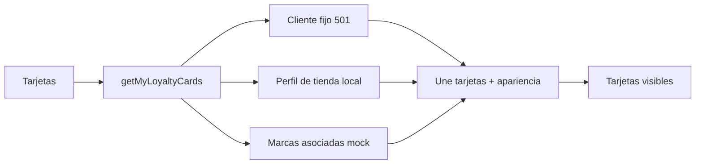

# Cliente · Tarjetas de fidelidad

El usuario autenticado no determina las tarjetas mostradas. El ID `501` es constante hasta que exista un endpoint de tarjetas del cliente.

## Referencias de código

- [Pantalla de tarjetas](https://github.com/gonzalotev/app-fidelidad/blob/afec4792729b48de4646168846ab221c96352f51/app/(tabs)/my-loyalty-cards/index.tsx#L1-L120)
- [Cliente fijo y composición local](https://github.com/gonzalotev/app-fidelidad/blob/afec4792729b48de4646168846ab221c96352f51/src/features/auth/services/authService.ts#L42-L150)

## API objetivo

`GET /clientes/me/tarjetas` debe resolver la identidad desde el JWT y devolver una tarjeta por marca, con saldos compartidos entre sus sucursales.
