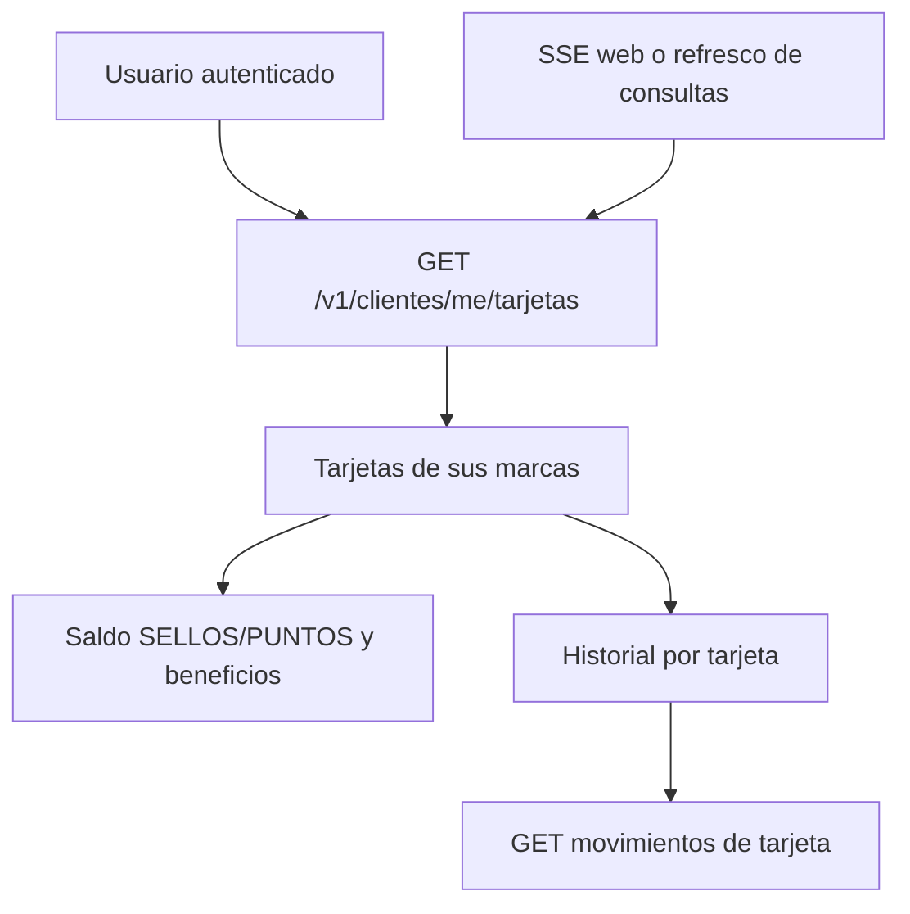

# Tarjetas de fidelidad

```mermaid
flowchart TD
 U[Usuario autenticado] --> API[GET /v1/clientes/me/tarjetas]
 API --> C[Tarjetas de sus marcas]
 C --> B[Saldo SELLOS/PUNTOS y beneficios]
 C --> H[Historial por tarjeta]
 H --> M[GET movimientos de tarjeta]
 E[SSE web o refresco de consultas] --> API
```

El servicio recorre páginas de tarjetas del usuario. El historial consulta una tarjeta autorizada; sus saldos y snapshots provienen del ledger. Logos/imágenes usan URLs temporales cuando media está disponible, con fallback visual si la firma falla. No hay un cliente fijo `501` compartido por las cuentas.

Revisión de fuentes y runtime del **02/10/2026, 22:30–22:33 UTC**. Los SHA y las diferencias por ambiente están en [Estado observado](#/runtime-snapshot). Esta revisión describe arquitectura e integración; no certifica todos los invariantes de negocio ni ejecuta operaciones sobre cuentas reales.

## Referencias de código

- [Implementación frontend](https://github.com/gonzalotev/app-fidelidad/blob/main/src/features/demo/services/demoService.ts)
- [Rutas API](https://github.com/am-p/app-loyalty/blob/main/cmd/server/router.go)
