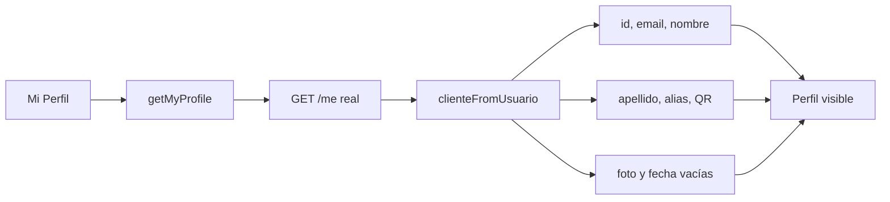

# Cliente · Perfil

La lectura básica está conectada. La edición completa y los campos específicos de cliente aún no tienen contrato persistente.

## Referencias de código

- [Pantalla Mi Perfil](https://github.com/gonzalotev/app-fidelidad/blob/1db7717e1aa28c2c1be7ba3538bfe9e22e0d0a01/app/(tabs)/my-profile/index.tsx#L1-L140)
- [Mapeo híbrido desde usuario](https://github.com/gonzalotev/app-fidelidad/blob/1db7717e1aa28c2c1be7ba3538bfe9e22e0d0a01/src/features/auth/services/authService.ts#L46-L62)
