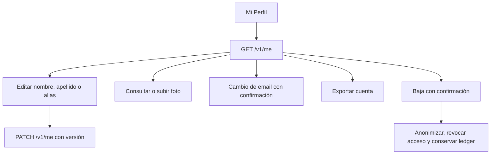

# Perfil del cliente

```mermaid
flowchart TD
 P[Mi Perfil] --> ME[GET /v1/me]
 ME --> E[Editar nombre, apellido o alias]
 E --> U[PATCH /v1/me con versión]
 ME --> F[Consultar o subir foto]
 ME --> C[Cambio de email con confirmación]
 ME --> X[Exportar cuenta]
 ME --> D[Baja con confirmación]
 D --> B[Anonimizar, revocar acceso y conservar ledger]
```

`profileService` consulta identidad real y envía mutaciones con precondición de versión. El cambio de email requiere autenticación reciente y correo de confirmación. La baja no borra el ledger; el backend puede detenerla si hay un cobro pendiente de conciliación. Foto depende del proveedor de media del ambiente. Las fechas/identidad no se rellenan como fixtures compartidas.

Revisión de fuentes y runtime del **02/10/2026, 22:10 UTC**. Los SHA y las diferencias por ambiente están en [Estado observado](#/runtime-snapshot). Esta revisión describe arquitectura e integración; no certifica todos los invariantes de negocio ni ejecuta operaciones sobre cuentas reales.

## Referencias de código

- [Implementación frontend](https://github.com/gonzalotev/app-fidelidad/blob/main/src/features/profile/services/profileService.ts)
- [Rutas API](https://github.com/am-p/app-loyalty/blob/main/cmd/server/router.go)
