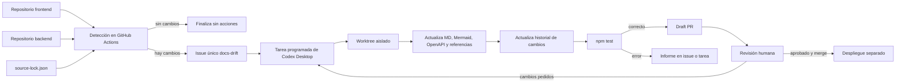

# Plan de actualización automática de la documentación

> **Estado:** implementación en curso. La detección, el historial y la tarea diaria de Codex están preparados en el primer PR; todavía falta validar el workflow en GitHub y completar una sincronización real de punta a punta.
>
> **Objetivo:** mantener esta documentación sincronizada con los repositorios de frontend y backend mediante el flujo **detección automática → tarea de Codex → PR documental → revisión humana → publicación**, sin utilizar `OPENAI_API_KEY` ni fusionar cambios automáticamente.

## 1. Resultado esperado

Cuando cambie el frontend o el backend:

1. GitHub detectará que el commit remoto ya no coincide con `docs/meta/source-lock.json`.
2. Se creará o actualizará un único issue de desactualización documental.
3. Una tarea programada de Codex en la aplicación de escritorio analizará el cambio desde un worktree aislado.
4. Codex actualizará los Markdown, diagramas Mermaid, referencias, `openapi.yaml` y el historial que correspondan.
5. Codex ejecutará todas las validaciones y abrirá un **draft PR**.
6. Una persona revisará el PR y decidirá si se aprueba, se corrige o se rechaza.
7. Al hacer merge, el despliegue actual publicará la nueva versión de la documentación.

La detección podrá funcionar aunque la computadora local esté apagada. La generación inteligente del PR necesitará que la Mac esté encendida y que la aplicación Codex pueda ejecutar la tarea programada.

### Estado de implementación al 2026-08-21

| Componente | Estado | Evidencia |
|---|---|---|
| Detector de commits | Implementado localmente | `scripts/detect-source-drift.mjs` |
| Pruebas del detector | Implementadas y aprobadas | `tests/source-drift.test.mjs` |
| Workflow de GitHub | Implementado, pendiente de ejecución en `main` | `.github/workflows/detect-doc-drift.yml` |
| Historial documental | Implementado | `docs/references/05-change-history.md` |
| Tarea programada de Codex | Activa, diariamente a las 10:00 | Automatización `Sincronizar documentación Puntazo` |
| Primera sincronización | Documentada, pendiente de merge | Frontend actualizado de `99a350bd` a `afec4792` en el draft PR #1 |

## 2. Alcance

### Incluido

- Vigilar los commits principales de:
  - frontend: `gonzalotev/app-fidelidad`;
  - backend: `am-p/app-loyalty`.
- Compararlos con los commits registrados en `docs/meta/source-lock.json`.
- Evitar issues duplicados.
- Analizar únicamente el rango de commits nuevo.
- Actualizar sólo la documentación afectada.
- Mantener referencias al código fijadas a commits exactos.
- Registrar cada actualización aceptada en un historial legible por humanos y LLM.
- Ejecutar `npm test` antes de abrir el PR.
- Abrir el PR como borrador y dejar el merge bajo control humano.

### Fuera de alcance

- Modificar el código del frontend o backend.
- Aprobar decisiones de negocio automáticamente.
- Convertir una `PROPUESTA CODEX` en `ACORDADO` sin confirmación humana.
- Hacer merge o desplegar automáticamente desde Codex.
- Usar `OPENAI_API_KEY` o la GitHub Action de Codex que requiere facturación de API separada.

## 3. Arquitectura del flujo



## 4. Fase A — detección automática en GitHub

### Componentes implementados

- `.github/workflows/detect-doc-drift.yml`
- `scripts/detect-source-drift.mjs`
- etiqueta de GitHub `docs-drift`

### Comportamiento

El workflow se ejecutará:

- cada 6 horas mediante `schedule`;
- manualmente mediante `workflow_dispatch`;
- opcionalmente después de un push en el repositorio documental.

El script deberá:

1. Leer los repositorios y commits registrados en `docs/meta/source-lock.json`.
2. Consultar el commit actual de la rama principal de cada repositorio fuente.
3. Informar qué repositorio quedó adelantado y el rango de commits pendiente.
4. Buscar un issue abierto con la etiqueta `docs-drift`.
5. Crear el issue si no existe o actualizar el existente si ya estaba abierto.
6. Cerrar el issue cuando ambos commits vuelvan a coincidir, idealmente después del merge documental.

### Seguridad y permisos

El workflow utilizará únicamente `GITHUB_TOKEN`, con los permisos mínimos:

```yaml
permissions:
  contents: read
  issues: write
```

No almacenará credenciales de OpenAI ni podrá modificar los repositorios fuente.

## 5. Fase B — tarea programada de Codex

### Frecuencia propuesta

- Todos los días a las **10:00**, zona horaria `America/Argentina/Buenos_Aires`.
- También podrá ejecutarse manualmente cuando el equipo necesite actualizar la documentación de inmediato.

### Condiciones de ejecución

La tarea continuará sólo si existe un issue abierto `docs-drift` o si detecta una diferencia real contra `source-lock.json`. Si no hay cambios, finalizará sin crear ramas ni PR.

### Instrucciones mínimas para Codex

1. Trabajar en un worktree aislado del repositorio `puntazo-docs`.
2. No modificar los repositorios fuente.
3. Obtener ambos rangos de commits pendientes.
4. Analizar primero el diff y clasificar el impacto:
   - arquitectura;
   - flujos de frontend;
   - componentes;
   - secuencias;
   - integración frontend/backend;
   - datos;
   - contrato OpenAPI;
   - brechas o decisiones pendientes.
5. Actualizar sólo los documentos afectados y conservar la precedencia de evidencia definida en `docs/references/03-documentation-rules.md`.
6. Cambiar `docs/meta/source-lock.json` únicamente después de completar el análisis.
7. Agregar una entrada al historial de cambios.
8. Ejecutar `npm test`.
9. Crear una rama con nombre `docs/sync-AAAA-MM-DD-<resumen>`.
10. Hacer push usando la sesión existente de GitHub CLI.
11. Abrir un draft PR con resumen, evidencia, validaciones y puntos que requieren revisión.
12. Nunca aprobar ni fusionar el PR.

## 6. Fase C — contenido obligatorio del PR

El draft PR deberá responder claramente:

- ¿Qué commits nuevos fueron analizados?
- ¿Qué cambió realmente en frontend y/o backend?
- ¿Qué documentos fueron actualizados y por qué?
- ¿Cambió algún contrato HTTP o estructura de datos?
- ¿Aparecieron nuevas brechas entre frontend, backend y spec?
- ¿Qué afirmaciones provienen del código?
- ¿Qué elementos continúan siendo propuestas de Codex?
- ¿Qué decisiones necesita tomar el equipo?
- ¿Qué validaciones se ejecutaron y cuál fue el resultado?

Plantilla sugerida:

```md
## Fuentes analizadas
- Frontend: `<commit anterior>..<commit nuevo>`
- Backend: `<commit anterior>..<commit nuevo>`

## Cambios detectados
- ...

## Documentación actualizada
- ...

## Decisiones pendientes
- ...

## Validaciones
- [ ] `npm test`
- [ ] Referencias fijadas a commits
- [ ] Mermaid válido
- [ ] OpenAPI válido
- [ ] `source-lock.json` actualizado
```

## 7. Fase D — historial documental

El archivo `docs/references/05-change-history.md` registra las sincronizaciones aceptadas. No debe ser un duplicado de `git log`: debe explicar el efecto funcional de cada sincronización.

Cada entrada tendrá:

| Campo | Contenido |
|---|---|
| Fecha | Fecha de aprobación o merge |
| PR documental | Enlace al PR aceptado |
| Frontend | Commit anterior, commit nuevo y enlace al diff |
| Backend | Commit anterior, commit nuevo y enlace al diff |
| Cambios detectados | Resumen funcional, no sólo nombres de archivos |
| Documentos modificados | Rutas Markdown, Mermaid u OpenAPI |
| Decisiones | Aprobadas, rechazadas o todavía pendientes |
| Validaciones | Resultado de pruebas y controles |

## 8. Revisión humana y publicación

El revisor deberá comprobar como mínimo:

1. Que los commits indicados sean correctos.
2. Que el texto describa el código y no invente comportamiento.
3. Que las propuestas estén marcadas como propuestas.
4. Que los flujos afectados sigan separados por área del frontend.
5. Que `openapi.yaml` sólo cambie cuando el contrato lo justifique.
6. Que `npm test` haya finalizado correctamente.
7. Que el historial describa el cambio con lenguaje comprensible.

Después del merge, el despliegue del repositorio documental publicará el contenido. El despliegue no dependerá de la tarea local de Codex.

## 9. Manejo de errores

| Situación | Acción esperada |
|---|---|
| GitHub no puede consultar un repositorio | Mantener o actualizar el issue con el error; no asumir que no hubo cambios |
| La Mac está apagada | El issue permanece abierto hasta la próxima ejecución de Codex |
| Codex encuentra una decisión ambigua | Documentarla como pendiente; no modificar el acuerdo de negocio |
| Falla `npm test` | No abrir un PR listo para revisión; informar la falla con su salida relevante |
| Ya existe un draft PR para el mismo rango | Actualizarlo o finalizar sin crear un duplicado |
| El repositorio fuente reescribe su historia | Detener la actualización y solicitar revisión humana |
| Cambian ambos repositorios | Analizar ambos rangos en el mismo PR cuando formen parte de una misma sincronización |

## 10. Criterios de aceptación

La automatización se considerará preparada cuando:

- [ ] Un cambio simulado de commit abra o actualice un único issue `docs-drift`.
- [ ] Una ejecución sin cambios no cree issues, ramas ni PR.
- [x] La tarea de Codex funcione sin `OPENAI_API_KEY`.
- [ ] Codex trabaje en un worktree aislado.
- [x] El PR incluya rangos de commits y documentos afectados.
- [x] `docs/meta/source-lock.json` se actualice con commits completos de 40 caracteres.
- [x] Las referencias al código apunten a los nuevos commits documentados.
- [x] El historial de cambios reciba una entrada verificable.
- [ ] `npm test` pase antes de solicitar revisión.
- [ ] Codex no pueda hacer merge automáticamente.
- [ ] El merge publique correctamente el sitio separado.

## 11. Orden de implementación

1. [x] Crear el historial `docs/references/05-change-history.md`.
2. [x] Implementar y probar localmente `scripts/detect-source-drift.mjs`.
3. [x] Agregar el workflow de detección y la gestión automática de la etiqueta `docs-drift`.
4. [ ] Probar la detección mediante `workflow_dispatch` después de integrar este primer PR.
5. [x] Crear y activar la tarea programada de Codex Desktop a las 10:00.
6. [x] Procesar el cambio real detectado en frontend y documentarlo en el primer draft PR.
7. [ ] Revisar el primer PR manualmente y ajustar las instrucciones de la tarea.
8. [ ] Confirmar el funcionamiento periódico de punta a punta.

## 12. Decisiones pendientes antes de implementarlo

- Confirmar quiénes serán los revisores obligatorios de los PR documentales.
- Definir si un cambio simultáneo de frontend y backend debe producir uno o dos PR.
- Definir cuántos días conservar un issue `docs-drift` con errores antes de escalarlo.
