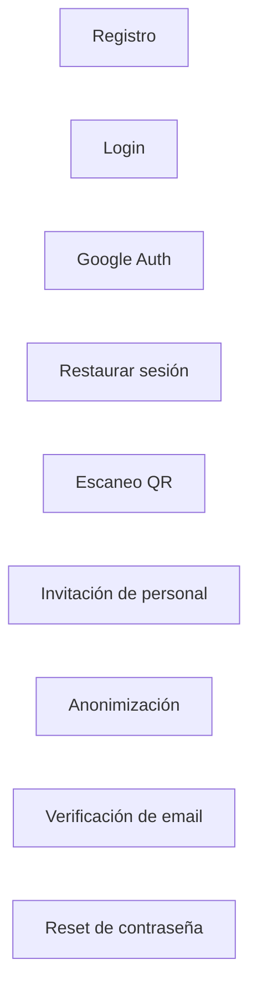

# Secuencias principales

```mermaid
flowchart LR
    REGISTER["Registro"]
    LOGIN["Login"]
    GOOGLE["Google Auth"]
    RESTORE["Restaurar sesión"]
    SCAN["Escaneo QR"]
    INVITE["Invitación de personal"]
    ANON["Anonimización"]
    VERIFY["Verificación de email"]
    RESET["Reset de contraseña"]

    click REGISTER href "#/sequence-register" "Abrir registro"
    click LOGIN href "#/sequence-login" "Abrir login"
    click GOOGLE href "#/sequence-google" "Abrir Google"
    click RESTORE href "#/sequence-restore" "Abrir restauración"
    click SCAN href "#/sequence-scan" "Abrir escaneo"
    click INVITE href "#/sequence-invitation" "Abrir invitación"
    click ANON href "#/sequence-account-anonymization" "Abrir anonimización"
    click VERIFY href "#/sequence-email-verification" "Abrir verificación"
    click RESET href "#/sequence-password-reset" "Abrir reset"
```
