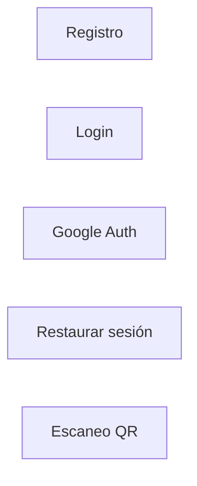

# Secuencias principales

```mermaid
flowchart LR
    REGISTER["Registro"]
    LOGIN["Login"]
    GOOGLE["Google Auth"]
    RESTORE["Restaurar sesión"]
    SCAN["Escaneo QR"]

    click REGISTER href "#/sequence-register" "Abrir registro"
    click LOGIN href "#/sequence-login" "Abrir login"
    click GOOGLE href "#/sequence-google" "Abrir Google"
    click RESTORE href "#/sequence-restore" "Abrir restauración"
    click SCAN href "#/sequence-scan" "Abrir escaneo"
```
