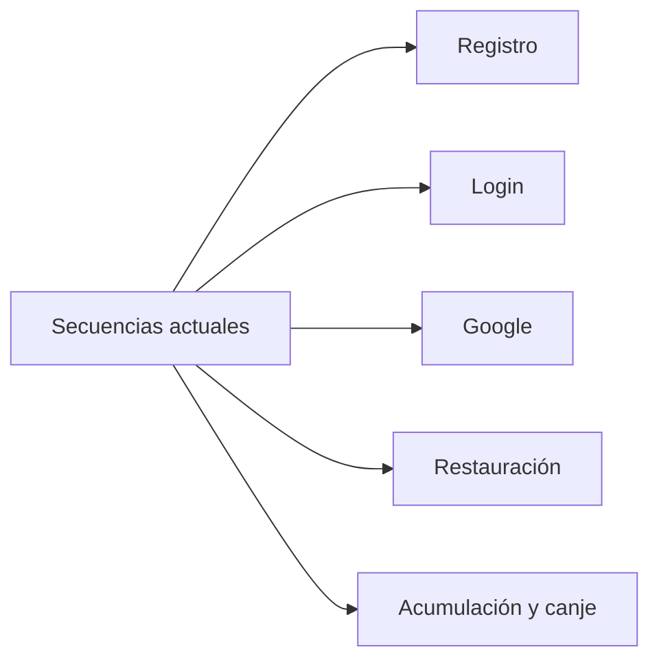

# Secuencias de ejecución

```mermaid
flowchart LR
 A[Secuencias actuales] --> R[Registro]
 A --> L[Login]
 A --> G[Google]
 A --> S[Restauración]
 A --> M[Acumulación y canje]
 click R href "#/sequence-register" "Abrir registro"
 click L href "#/sequence-login" "Abrir login"
 click G href "#/sequence-google" "Abrir Google"
 click S href "#/sequence-restore" "Abrir restauración"
 click M href "#/sequence-scan" "Abrir movimientos"
```

Estas vistas describen las rutas reales de las fuentes revisadas. Para saber qué configuración está publicada, leer [Estado observado](#/runtime-snapshot).
