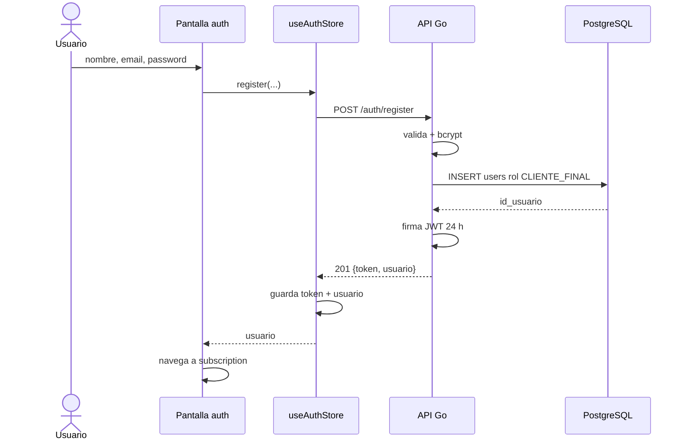

# Secuencia · Registro por email

El request sólo admite nombre, email y contraseña. El backend asigna `CLIENTE_FINAL`; por eso todavía no implementa el alta separada de `PERSONAL_MARCA` definida en el spec.

## Referencias de código

- [Pantalla de autenticación](https://github.com/gonzalotev/app-fidelidad/blob/99a350bd6e204a1f866d78dcfb20bd9bc108ffda/app/(auth)/index.tsx#L31-L76)
- [Handler RegisterUser](https://github.com/am-p/app-loyalty/blob/f03b9aa202587510508a6f2a094b808f5ed6353d/internal/handler/user.go#L23-L70)
- [Hash y creación de usuario](https://github.com/am-p/app-loyalty/blob/f03b9aa202587510508a6f2a094b808f5ed6353d/internal/service/user.go#L19-L38)
