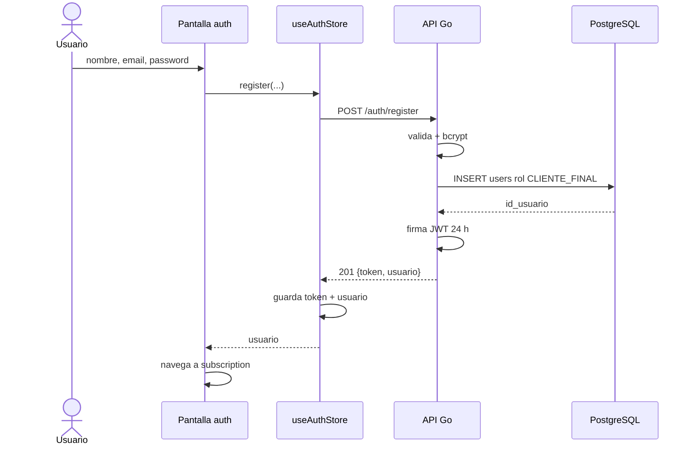

# Secuencia · Registro por email

El request sólo admite nombre, email y contraseña. El backend asigna
`CLIENTE_FINAL`; el alta de personal de marca usa un flujo separado. En la rama
`staging` fijada, `DEMO_SIGNUP_ENABLED=false` cierra este registro con
`403 DEMO_SIGNUP_DISABLED`, además del alta comercial. La secuencia del diagrama
sólo continúa cuando el flag se habilita expresamente en un ambiente controlado.

## Corte hacia el contrato aprobado

La secuencia anterior describe el código fuente bloqueado. En el objetivo `PR-09`,
el registro por email puede devolver `201 {usuario, verification_required:true}`
sin sesión. La UI debe llevar a verificación y sólo persistir credenciales de sesión
cuando realmente estén presentes. Producción no habilita login por contraseña hasta
confirmar el email mediante la [secuencia de verificación](#/sequence-email-verification).

Este corte permanece `NOT_IMPLEMENTED`; no debe inferirse de este documento que el
backend o frontend actuales ya soportan la respuesta condicional.

## Referencias de código

- [Pantalla de autenticación](https://github.com/gonzalotev/app-fidelidad/blob/1db7717e1aa28c2c1be7ba3538bfe9e22e0d0a01/app/(auth)/index.tsx#L31-L76)
- [Handler RegisterUser](https://github.com/gagonzalez1/app-loyalty/blob/50e95e9407ee5ffaccfc3cebcbef464d24f26427/internal/handler/user.go#L23-L70)
- [Cierre de alta, hash y creación de usuario](https://github.com/gagonzalez1/app-loyalty/blob/50e95e9407ee5ffaccfc3cebcbef464d24f26427/internal/service/auth.go)
