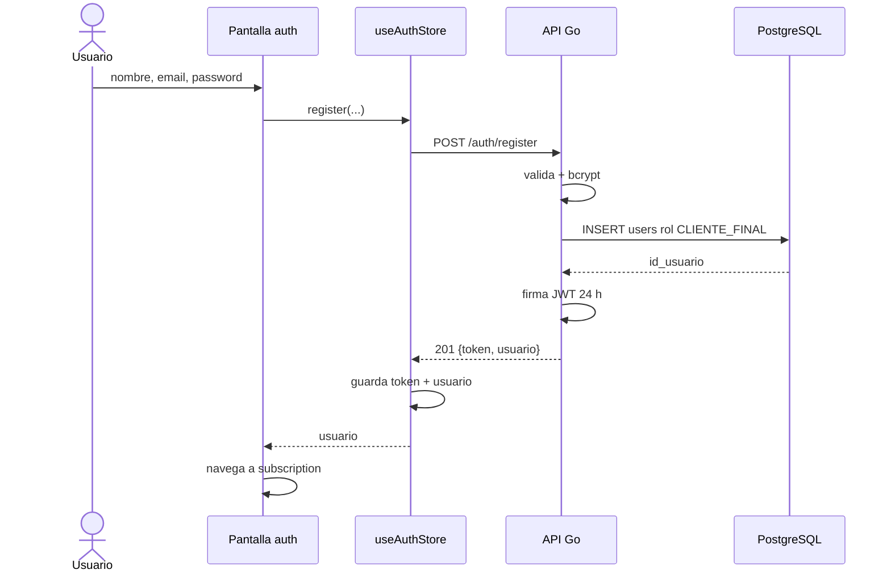

# Secuencia · Registro por email

El request sólo admite nombre, email y contraseña. El backend asigna `CLIENTE_FINAL`; por eso todavía no implementa el alta separada de `PERSONAL_MARCA` definida en el spec.

## Corte hacia el contrato aprobado

La secuencia anterior describe el código fuente bloqueado. En el objetivo `PR-09`,
el registro por email puede devolver `201 {usuario, verification_required:true}`
sin sesión. La UI debe llevar a verificación y sólo persistir credenciales de sesión
cuando realmente estén presentes. Producción no habilita login por contraseña hasta
confirmar el email mediante la [secuencia de verificación](#/sequence-email-verification).

Este corte permanece `NOT_IMPLEMENTED`; no debe inferirse de este documento que el
backend o frontend actuales ya soportan la respuesta condicional.

## Referencias de código

- [Pantalla de autenticación](https://github.com/gonzalotev/app-fidelidad/blob/afec4792729b48de4646168846ab221c96352f51/app/(auth)/index.tsx#L31-L76)
- [Handler RegisterUser](https://github.com/am-p/app-loyalty/blob/f03b9aa202587510508a6f2a094b808f5ed6353d/internal/handler/user.go#L23-L70)
- [Hash y creación de usuario](https://github.com/am-p/app-loyalty/blob/f03b9aa202587510508a6f2a094b808f5ed6353d/internal/service/user.go#L19-L38)
