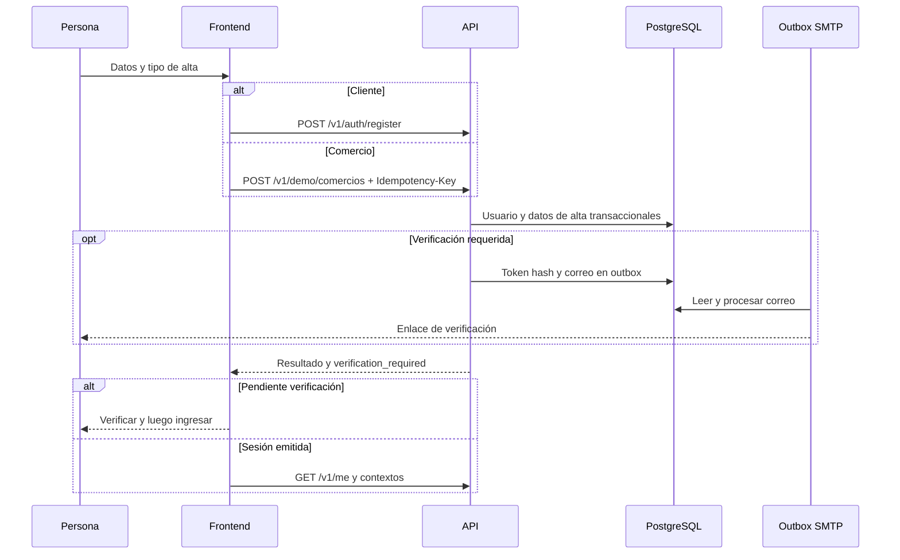

# Registro por email

```mermaid
sequenceDiagram
 participant U as Persona
 participant F as Frontend
 participant A as API
 participant P as PostgreSQL
 participant W as Outbox SMTP
 U->>F: Datos y tipo de alta
 alt Cliente
 F->>A: POST /v1/auth/register
 else Comercio
 F->>A: POST /v1/demo/comercios + Idempotency-Key
 end
 A->>P: Usuario y datos de alta transaccionales
 opt Verificación requerida
 A->>P: Token hash y correo en outbox
 W->>P: Leer y procesar correo
 W-->>U: Enlace de verificación
 end
 A-->>F: Resultado y verification_required
 alt Pendiente verificación
 F-->>U: Verificar y luego ingresar
 else Sesión emitida
 F->>A: GET /v1/me y contextos
 end
```

El registro comercial crea contexto de marca/sucursal y programa. Una respuesta pendiente no se convierte en login. La configuración de altas y correo se verifica por ambiente; esta revisión no generó usuarios ni envió correos.

Revisión de fuentes y runtime del **02/10/2026, 22:10 UTC**. Los SHA y las diferencias por ambiente están en [Estado observado](#/runtime-snapshot). Esta revisión describe arquitectura e integración; no certifica todos los invariantes de negocio ni ejecuta operaciones sobre cuentas reales.

## Referencias de código

- [Implementación backend](https://github.com/am-p/app-loyalty/blob/main/internal/service/auth.go)
- [Servicio frontend](https://github.com/gonzalotev/app-fidelidad/blob/main/src/features/demo/services/demoService.ts)
- [Cliente y refresh](https://github.com/gonzalotev/app-fidelidad/blob/main/src/core/api/client.ts)
