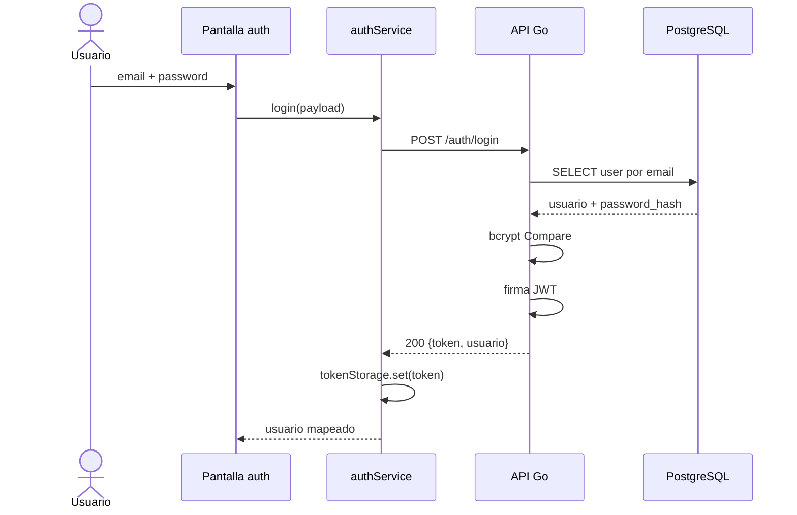

# Secuencia · Login por email

Los fallos de credenciales se normalizan como `401`. Una cuenta creada sólo con Google no puede ingresar con contraseña hasta que exista un flujo explícito para definirla.

## Referencias de código

- [Cliente auth del frontend](https://github.com/gonzalotev/app-fidelidad/blob/main/src/features/auth/services/authService.ts#L82-L106)
- [Login handler](https://github.com/am-p/app-loyalty/blob/main/internal/handler/user.go#L72-L111)
- [Verificación bcrypt](https://github.com/am-p/app-loyalty/blob/main/internal/service/user.go#L40-L58)
