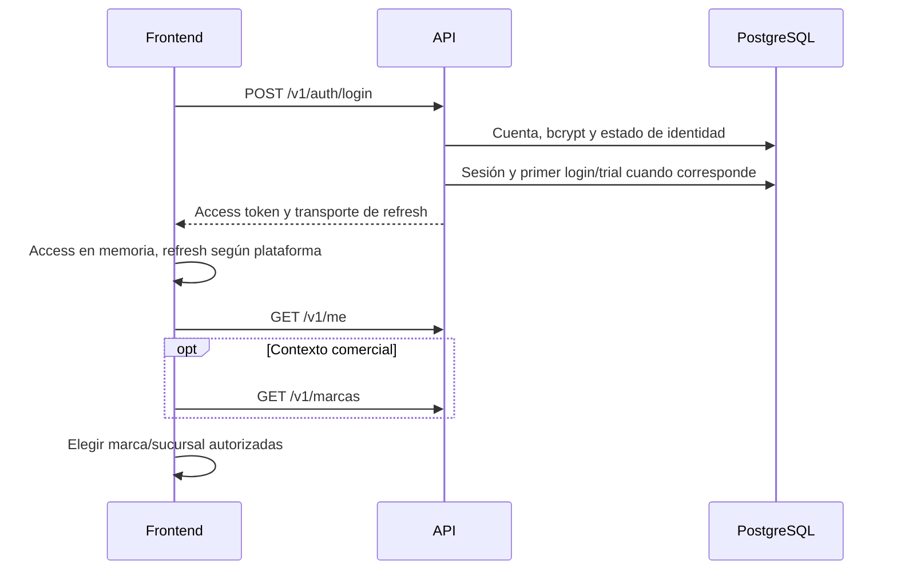

# Login por email

```mermaid
sequenceDiagram
 participant F as Frontend
 participant A as API
 participant P as PostgreSQL
 F->>A: POST /v1/auth/login
 A->>P: Cuenta, bcrypt y estado de identidad
 A->>P: Sesión y primer login/trial cuando corresponde
 A-->>F: Access token y transporte de refresh
 F->>F: Access en memoria, refresh según plataforma
 F->>A: GET /v1/me
 opt Contexto comercial
 F->>A: GET /v1/marcas
 end
 F->>F: Elegir marca/sucursal autorizadas
```

El servidor controla cuenta activa y verificación. La cookie web y el refresh nativo no se tratan como un JWT permanente en localStorage. La fecha histórica de primer login puede estar marcada como estimada por migración.

Revisión de fuentes y runtime del **02/10/2026, 22:30–22:33 UTC**. Los SHA y las diferencias por ambiente están en [Estado observado](#/runtime-snapshot). Esta revisión describe arquitectura e integración; no certifica todos los invariantes de negocio ni ejecuta operaciones sobre cuentas reales.

## Referencias de código

- [Implementación backend](https://github.com/am-p/app-loyalty/blob/main/internal/service/auth.go)
- [Servicio frontend](https://github.com/gonzalotev/app-fidelidad/blob/main/src/features/demo/services/demoService.ts)
- [Cliente y refresh](https://github.com/gonzalotev/app-fidelidad/blob/main/src/core/api/client.ts)
