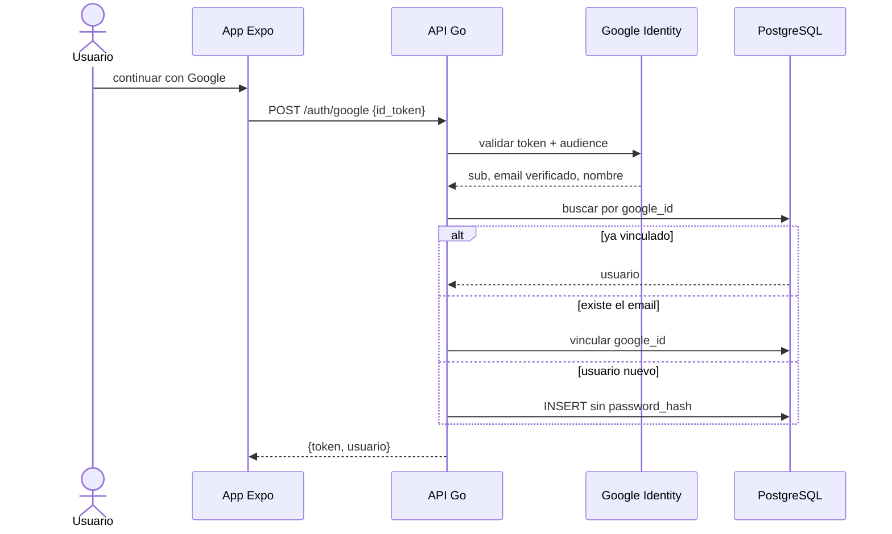

# Secuencia · Acceso con Google

La vinculación prioriza `google_id`, luego email. El usuario nuevo recibe también el rol fijo `CLIENTE_FINAL`.

En el objetivo aprobado `PR-09`, el backend rechaza el alta o enlace si el ID token
no confirma `email_verified=true`. Cuando sí lo confirma, registra la identidad local
como verificada. Esta regla permanece `NOT_IMPLEMENTED` hasta contar con código y pruebas.

## Referencias de código

- [Endpoint frontend Google](https://github.com/gonzalotev/app-fidelidad/blob/1db7717e1aa28c2c1be7ba3538bfe9e22e0d0a01/src/features/auth/services/authService.ts#L96-L105)
- [Orquestación Google en servicio](https://github.com/am-p/app-loyalty/blob/b87b00ce41d94b4cc719934fc3cc1a8ff18803c1/internal/service/user.go#L60-L95)
- [Validación de ID token](https://github.com/am-p/app-loyalty/blob/b87b00ce41d94b4cc719934fc3cc1a8ff18803c1/internal/auth/google.go#L13-L37)
