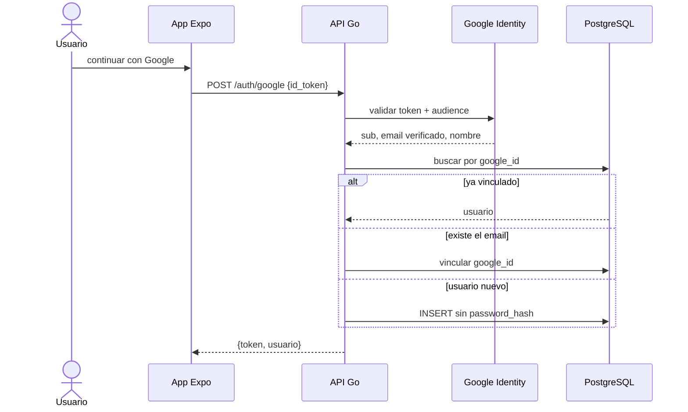

# Secuencia · Acceso con Google

## Actualización de códigos · rama pendiente de integrar

Google nuevo devuelve primero ACCOUNT_TYPE_REQUIRED con nombre/apellido de los
claims verificados y campos faltantes. El selector completa sólo lo faltante;
reenvía identidad, perfil y tipo. El backend prioriza given_name/family_name del
token y asigna código en la transacción de creación. Cuenta ya existente: login
directo, conserva código y no exige nuevos campos.

Fuente y estado: [reconciliación de códigos](#/user-codes-reconciliation).
Implementado y probado en las ramas seleccionadas; no desplegado.

## Referencia histórica anterior a esta entrega

El material siguiente describe la revisión documental anterior. No confirma
el estado actual de main ni del runtime; contrastar con la rama elegida.

```mermaid
sequenceDiagram
    actor U as Usuario
    participant APP as App Expo
    participant API as API Go
    participant G as Google Identity
    participant DB as PostgreSQL
    U->>APP: continuar con Google
    APP->>API: POST /auth/google {id_token}
    API->>G: validar token + audience
    G-->>API: sub, email verificado, nombre
    API->>DB: buscar por google_id
    alt ya vinculado
      DB-->>API: usuario
    else existe el email
      API->>DB: vincular google_id
    else usuario nuevo
      API->>DB: INSERT sin password_hash
    end
    API-->>APP: {token, usuario}
```

La vinculación prioriza `google_id`, luego email. El usuario nuevo recibe también el rol fijo `CLIENTE_FINAL`.

## Referencias de código

- [Endpoint frontend Google](https://github.com/gonzalotev/app-fidelidad/blob/main/src/features/auth/services/authService.ts#L96-L105)
- [Orquestación Google en servicio](https://github.com/am-p/app-loyalty/blob/main/internal/service/user.go#L60-L95)
- [Validación de ID token](https://github.com/am-p/app-loyalty/blob/main/internal/auth/google.go#L13-L37)
