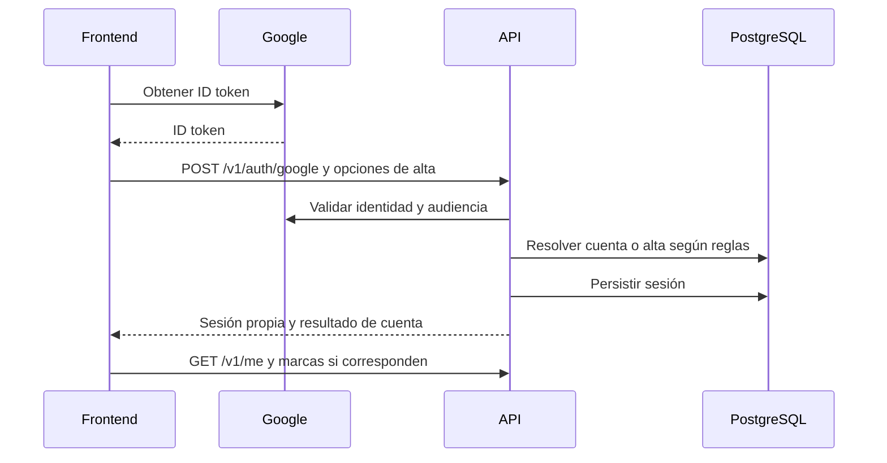

# Acceso con Google

```mermaid
sequenceDiagram
 participant F as Frontend
 participant G as Google
 participant A as API
 participant P as PostgreSQL
 F->>G: Obtener ID token
 G-->>F: ID token
 F->>A: POST /v1/auth/google y opciones de alta
 A->>G: Validar identidad y audiencia
 A->>P: Resolver cuenta o alta según reglas
 A->>P: Persistir sesión
 A-->>F: Sesión propia y resultado de cuenta
 F->>A: GET /v1/me y marcas si corresponden
```

La API distingue cuenta existente y alta, incluidos datos comerciales cuando el flujo los requiere. Los fallbacks legacy no aceptan degradar una selección de tipo/alta comercial a un contrato que no la soporta.

Para una cuenta Puntazo existente, un email coincidente no vincula identidades. El cliente autenticado inicia `POST /v1/auth/google/link` con el ID token Google y su contraseña actual; el backend valida el token, la contraseña y la ausencia de colisión del `sub`. La sesión puede reautenticarse con contraseña o con un ID token cuyo `sub` sea el ya vinculado mediante `POST /v1/auth/reauthenticate`. Un conflicto devuelve `409 GOOGLE_LINK_REQUIRED` o `409 GOOGLE_IDENTITY_CONFLICT`; nunca se reasigna el `sub`. Estos endpoints están implementados en fuente e integrados en el candidato backend `closed-test-readiness`; el job de deploy sigue QUEUED, por lo que la prueba Google de runtime continúa pendiente. No se incorpora recuperación/reclamación de cuentas históricas.

Revisión base de fuentes/runtime **02/10/2026, 22:30–22:33 UTC**; contrato de vinculación reconciliado con el candidato backend el **07/10/2026**. Los SHA y las diferencias por ambiente están en [Estado observado](#/runtime-snapshot). Esta revisión describe arquitectura e integración; no certifica todos los invariantes de negocio ni ejecuta operaciones sobre cuentas reales.

## Referencias de código

- [Implementación backend](https://github.com/am-p/app-loyalty/blob/main/internal/service/auth.go)
- [Servicio frontend](https://github.com/gonzalotev/app-fidelidad/blob/main/src/features/demo/services/demoService.ts)
- [Cliente y refresh](https://github.com/gonzalotev/app-fidelidad/blob/main/src/core/api/client.ts)
