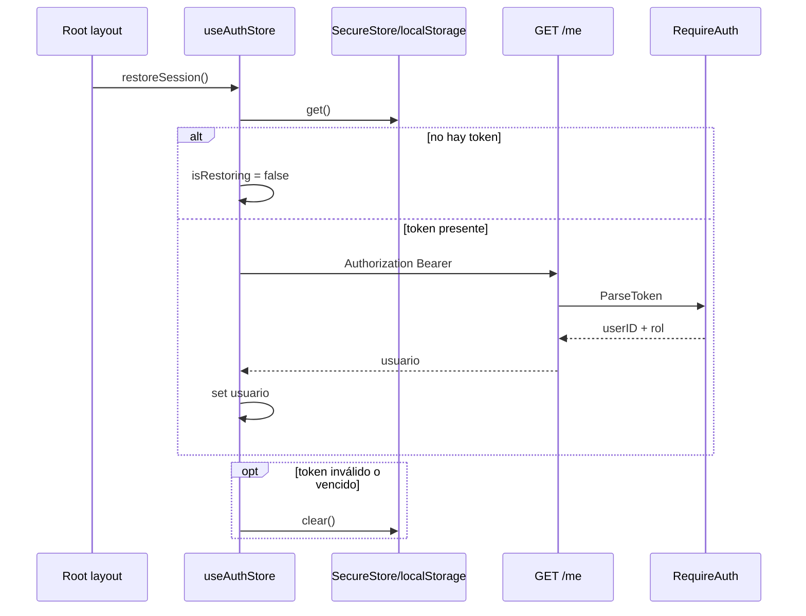

# Secuencia · Restaurar sesión

La llamada se dispara en el layout raíz. El layout de tabs decide redirecciones por `usuario` y `suscripcion`; conviene mantener visible este acoplamiento al diagnosticar saltos de navegación al inicio.

## Referencias de código

- [Disparo de restauración](https://github.com/gonzalotev/app-fidelidad/blob/main/app/_layout.tsx#L48-L51)
- [Restauración y descarte de token](https://github.com/gonzalotev/app-fidelidad/blob/main/src/features/auth/store/useAuthStore.ts#L50-L65)
- [Middleware de autenticación](https://github.com/am-p/app-loyalty/blob/main/internal/middleware/auth.go#L12-L34)
