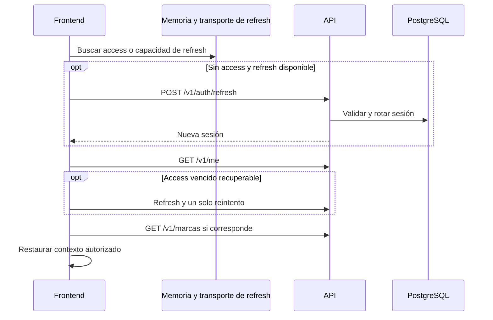

# Restauración de sesión

```mermaid
sequenceDiagram
 participant F as Frontend
 participant T as Memoria y transporte de refresh
 participant A as API
 participant P as PostgreSQL
 F->>T: Buscar access o capacidad de refresh
 opt Sin access y refresh disponible
 F->>A: POST /v1/auth/refresh
 A->>P: Validar y rotar sesión
 A-->>F: Nueva sesión
 end
 F->>A: GET /v1/me
 opt Access vencido recuperable
 F->>A: Refresh y un solo reintento
 end
 F->>A: GET /v1/marcas si corresponde
 F->>F: Restaurar contexto autorizado
```

Web usa cookie HttpOnly y access en memoria; nativo guarda refresh en SecureStore. Un fallo definitivo invalida sesión y caché; un error de red se distingue de una revocación. No se restaura un permiso comercial a partir de un plan local.

Revisión de fuentes y runtime del **02/10/2026, 22:30–22:33 UTC**. Los SHA y las diferencias por ambiente están en [Estado observado](#/runtime-snapshot). Esta revisión describe arquitectura e integración; no certifica todos los invariantes de negocio ni ejecuta operaciones sobre cuentas reales.

## Referencias de código

- [Implementación backend](https://github.com/am-p/app-loyalty/blob/main/internal/service/auth.go)
- [Servicio frontend](https://github.com/gonzalotev/app-fidelidad/blob/main/src/features/demo/services/demoService.ts)
- [Cliente y refresh](https://github.com/gonzalotev/app-fidelidad/blob/main/src/core/api/client.ts)
