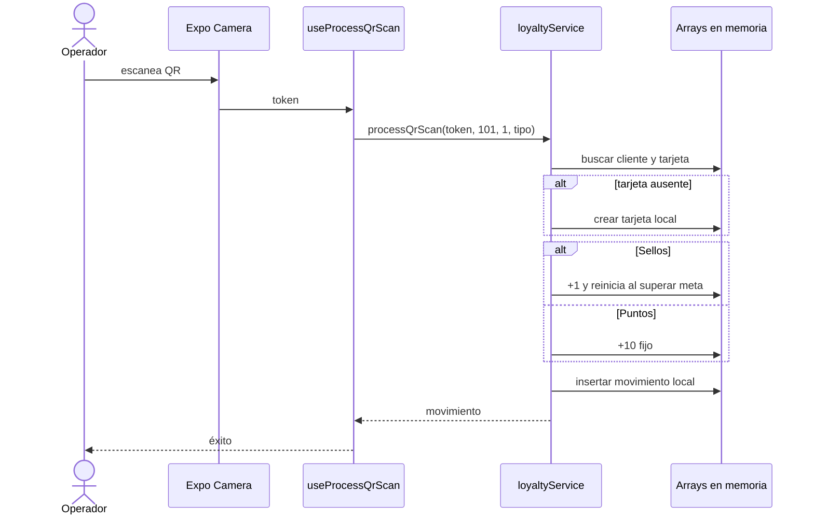

# Secuencia · Escaneo actual

## Diferencia con el objetivo

El objetivo aprobado usa `POST /movimientos/preview` y luego
`POST /movimientos/scan`. Preview conserva los nombres v1 `operation`, `branch_id`
y `benefit_id`; para PUNTOS agrega `cantidad_puntos` manual `1..100000` y responde
`id`, `balance_before`, `amount` y `balance_after`. Desde `10001` la UI reconfirma.
Scan envía `preview_id`, identidad y `branch_id`, sin repetir puntos; el backend
consume el snapshot inmutable, bloquea duplicados mediante idempotencia y escribe
saldo más movimiento en una transacción.

## Referencias de código

- [Hook de mutación](https://github.com/gonzalotev/app-fidelidad/blob/afec4792729b48de4646168846ab221c96352f51/src/features/loyalty/hooks/useLoyalty.ts#L16-L30)
- [Algoritmo local completo](https://github.com/gonzalotev/app-fidelidad/blob/afec4792729b48de4646168846ab221c96352f51/src/features/loyalty/services/loyaltyService.ts#L101-L147)
