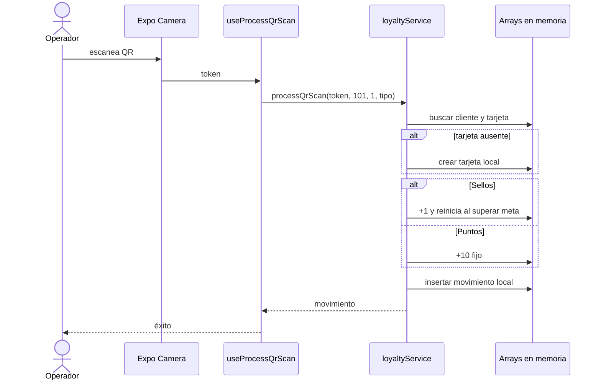

# Secuencia · Escaneo actual

## Actualización de códigos · rama pendiente de integrar

La API candidata admite customer_code GG-1 o #USER-0001, minúsculas y # opcional.
El código nuevo se resuelve consultando el usuario activo CLIENTE_FINAL. Preview
retorna customer.user_code; confirmación conserva permiso de operador, sucursal,
saldo, preview e idempotencia. El frontend muestra el código del servidor.

Fuente y estado: [reconciliación de códigos](#/user-codes-reconciliation).
Implementado y probado en las ramas seleccionadas; no desplegado.

## Referencia histórica anterior a esta entrega

El material siguiente describe la revisión documental anterior. No confirma
el estado actual de main ni del runtime; contrastar con la rama elegida.

```mermaid
sequenceDiagram
    actor O as Operador
    participant CAM as Expo Camera
    participant HOOK as useProcessQrScan
    participant MOCK as loyaltyService
    participant MEM as Arrays en memoria
    O->>CAM: escanea QR
    CAM->>HOOK: token
    HOOK->>MOCK: processQrScan(token, 101, 1, tipo)
    MOCK->>MEM: buscar cliente y tarjeta
    alt tarjeta ausente
      MOCK->>MEM: crear tarjeta local
    end
    alt Sellos
      MOCK->>MEM: +1 y reinicia al superar meta
    else Puntos
      MOCK->>MEM: +10 fijo
    end
    MOCK->>MEM: insertar movimiento local
    MOCK-->>HOOK: movimiento
    HOOK-->>O: éxito
```

## Diferencia con el objetivo

El futuro `POST /movimientos/scan` debe identificar marca y sucursal autorizadas, calcular puntos desde el importe, bloquear duplicados mediante idempotencia y escribir saldo más movimiento en una transacción.

## Referencias de código

- [Hook de mutación](https://github.com/gonzalotev/app-fidelidad/blob/main/src/features/loyalty/hooks/useLoyalty.ts#L16-L30)
- [Algoritmo local completo](https://github.com/gonzalotev/app-fidelidad/blob/main/src/features/loyalty/services/loyaltyService.ts#L101-L147)
