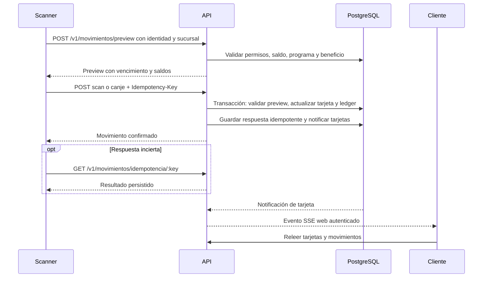

# Confirmación de acumulación o canje

```mermaid
sequenceDiagram
 participant F as Scanner
 participant A as API
 participant P as PostgreSQL
 participant C as Cliente
 F->>A: POST /v1/movimientos/preview con identidad y sucursal
 A->>P: Validar permisos, saldo, programa y beneficio
 A-->>F: Preview con vencimiento y saldos
 F->>A: POST scan o canje + Idempotency-Key
 A->>P: Transacción: validar preview, actualizar tarjeta y ledger
 A->>P: Guardar respuesta idempotente y notificar tarjetas
 A-->>F: Movimiento confirmado
 opt Respuesta incierta
 F->>A: GET /v1/movimientos/idempotencia/:key
 A-->>F: Resultado persistido
 end
 P-->>A: Notificación de tarjeta
 A-->>C: Evento SSE web autenticado
 C->>A: Releer tarjetas y movimientos
```

El saldo no se actualiza de forma autoritativa en memoria frontend. Se conserva la misma clave para resolver un resultado incierto. Los eventos avisan que hay que releer; no reemplazan el ledger ni permiten escribir offline.

Revisión de fuentes y runtime del **02/10/2026, 22:10 UTC**. Los SHA y las diferencias por ambiente están en [Estado observado](#/runtime-snapshot). Esta revisión describe arquitectura e integración; no certifica todos los invariantes de negocio ni ejecuta operaciones sobre cuentas reales.

## Referencias de código

- [Implementación backend](https://github.com/am-p/app-loyalty/blob/main/internal/repository/movement.go)
- [Servicio frontend](https://github.com/gonzalotev/app-fidelidad/blob/main/src/features/demo/services/demoService.ts)
- [Cliente y refresh](https://github.com/gonzalotev/app-fidelidad/blob/main/src/core/api/client.ts)
