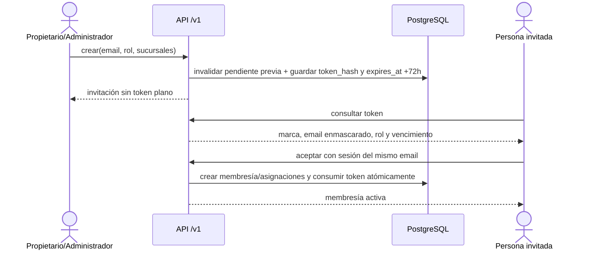

# Secuencia objetivo · Invitación de personal

`PR-05` aprueba los roles y el vencimiento. Reenvío revoca el token anterior;
vencida, revocada, reutilizada o con email distinto responde conflicto sin crear
permisos. Esta secuencia sigue `target` hasta contar con implementación y pruebas.
