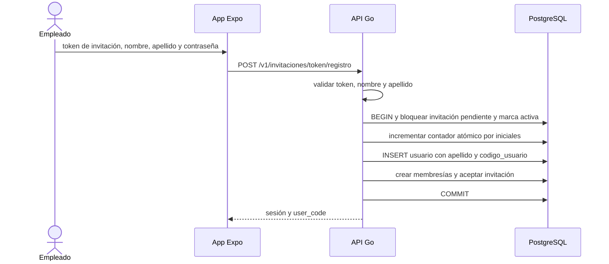

# Invitación y alta de empleado

Implementado en la rama candidata; [estado y evidencia](#/user-codes-reconciliation).
No implica despliegue ni integración de migraciones.

```mermaid
sequenceDiagram
    actor E as Empleado
    participant APP as App Expo
    participant API as API Go
    participant DB as PostgreSQL
    E->>APP: token de invitación, nombre, apellido y contraseña
    APP->>API: POST /v1/invitaciones/token/registro
    API->>API: validar token, nombre y apellido
    API->>DB: BEGIN y bloquear invitación pendiente y marca activa
    API->>DB: incrementar contador atómico por iniciales
    API->>DB: INSERT usuario con apellido y codigo_usuario
    API->>DB: crear membresías y aceptar invitación
    API->>DB: COMMIT
    API-->>APP: sesión y user_code
```

Un reintento de invitación aceptada se rechaza sin consumir otro código. Email
ya registrado y fallo de alta revierten transacción y contador. Aceptar una
invitación con cuenta existente no asigna otro código. El personal recibe su
código efectivo en la lista y lo muestra en su configuración de cuenta.

## Referencias de código

- [Repositorio de invitaciones](https://github.com/gagonzalez1/app-loyalty/blob/feat/user-codes-20260930/internal/repository/staff.go)
- [Formulario con apellido](https://github.com/gonzalotev/app-fidelidad/blob/feat/user-codes-20260930/app/invitacion.tsx)
